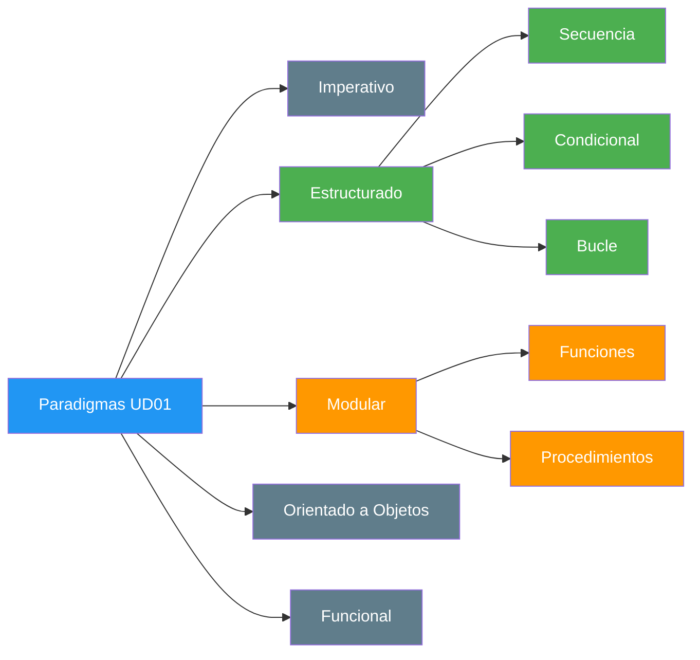
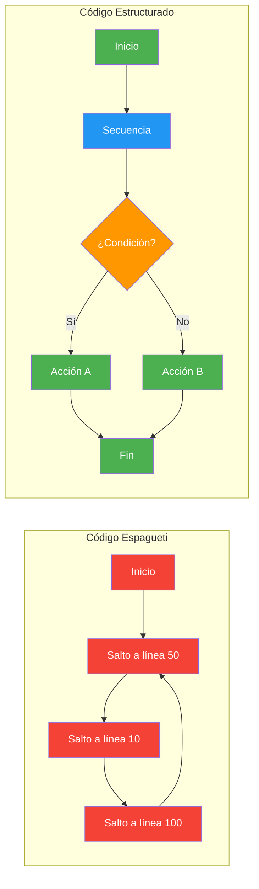
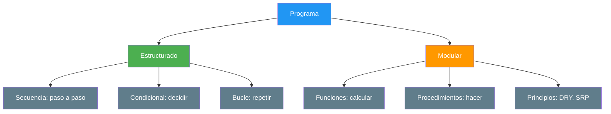
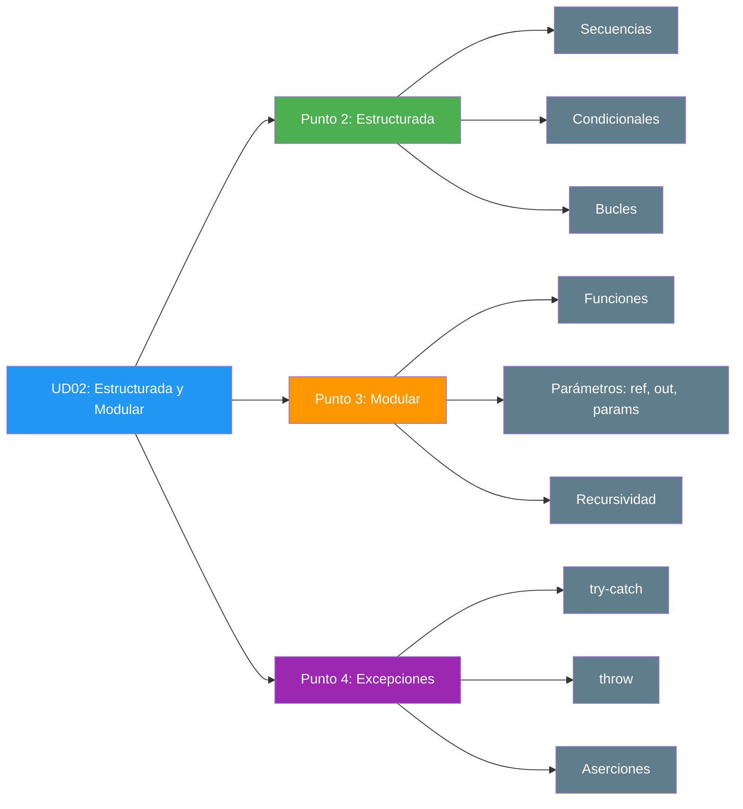

- [1. Introducción](#1-introducción)
  - [1.1. Programación Estructurada y Modular: un paradigma](#11-programación-estructurada-y-modular-un-paradigma)
  - [1.2. Del caos al orden: una analogía](#12-del-caos-al-orden-una-analogía)
  - [1.3. Conexión con UD01: lo que ya sabes](#13-conexión-con-ud01-lo-que-ya-sabes)
  - [1.4. ¿Qué aprenderás en esta unidad?](#14-qué-aprenderás-en-esta-unidad)

# 1. Introducción

> 💡 **Punto de partida:** ¿Alguna vez has intentado seguir una receta de cocina que no tenía pasos numerados? ¿O armar un mueble de IKEA sin instrucciones? Eso es programar sin estructura: el código funciona (a veces), pero nadie lo entiende ni lo puede mantener.

En la UD01 vimos qué es la programación, los algoritmos y los paradigmas. Aprendimos a escribir programas simples: declaremos variables, leamos datos, mostremos resultados. Pero ¿qué pasa cuando el problema crece? ¿Cómo organiza Netflix el algoritmo que decide qué serie recomendarte? ¿Cómo gestiona Instagram el filtro que aplica a tu foto?

La respuesta es: **programación estructurada y modular**.

## 1.1. Programación Estructurada y Modular: un paradigma

Recordarás de la UD01 que un **paradigma** es un estilo o filosofía de programación. La programación estructurada y modular es un **paradigma** que se basa en dos ideas fundamentales:

- **Estructurada**: el código se escribe usando solo tres estructuras de control (secuencia, condicional, bucle). Sin saltos desordenados.
- **Modular**: el código se divide en piezas pequeñas y reutilizables (funciones y procedimientos). Sin todo en un solo sitio.

📌 **Ejemplo real:** Netflix usa programación estructurada para el flujo de reproducción: secuencia (cargar vídeo → reproducir → pausar), condicionales (¿está suscrito? ¿hay conexión?) y bucles (¿seguir reproduciendo la siguiente serie?). Cada paso es claro, predecible y mantenible.

Antes de este paradigma, el código fluía de forma desordenada mediante saltos incondicionales (`GOTO`), lo que se conocía como **Código Espagueti**: una maraña de saltos imposible de mantener.

## 1.2. Del caos al orden: una analogía

Un programa bien estructurado es como una **empresa bien organizada**:

| Empresa | Programa |
|---------|----------|
| Cada departamento tiene una función clara | Cada módulo/responsabilidad está separada |
| Exist protocolos para tomar decisiones | Condicionales (`if`, `switch`) |
| Se repiten procesos cada mes | Bucles (`while`, `for`) |
| Un empleado no hace todo solo | Modularidad: funciones y procedimientos |

## 1.3. Conexión con UD01: lo que ya sabes

En la UD01 aprendiste las bases que ahora usaremos como cimientos:

| UD01 (Lo que sabes) | UD02 (Lo que aprenderás) |
|---------------------|--------------------------|
| Tipos de datos (`int`, `string`, `bool`) | Cómo pasarlos a funciones de forma segura |
| Variables y constantes | Ámbito: dónde vive cada variable |
| Entrada por consola (`Console.ReadLine()`) | `TryParse` para convertir de forma segura |
| Salida por consola (`Console.WriteLine()`) | Interpolación y formateo avanzado |
| Operadores aritméticos y lógicos | Condicionales complejos (`if-else`, `switch`) |
| Conversión de tipos | Casting explícito y reglas de exactitud |
| Paradigmas de programación | Profundizar en estructurado y modular |

📌 **Ejemplo real:** Instagram lee tu nombre (string), tu edad (int) y tu email (string). En UD01 solo sabías mostrarlos. En UD02 aprenderás a pasarlos a funciones que validen, calculen y tomen decisiones con esos datos.

## 1.4. ¿Qué aprenderás en esta unidad?

Al finalizar esta unidad serás capaz de:

- **Escribir código claro** usando secuencias, condicionales y bucles
- **Tomar decisiones** con `if-else`, `switch` y el operador ternario
- **Repetir tareas** con `while`, `for` y `do-while`
- **Dividir problemas** en funciones y procedimientos reutilizables
- **Pasar datos de forma segura** con `ref`, `out` y `params`
- **Manejar errores** con `try-catch-finally` y `throw`
- **Depurar código** con asertaciones

> 💡 **Consejo:** Esta unidad es la base de todo lo que viene. Si dominas estructurada y modular, la POO (UD04) será mucho más fácil. Piensa en ella como aprender a cocinar antes de abrir un restaurante.

En el siguiente punto veremos la programación estructurada en profundidad: secuencias, condicionales (`if-else`, `switch`, ternario), bucles (`while`, `for`, `do-while`) y el operador `??`.
