- [2. Programación Estructurada](#2-programación-estructurada)
  - [2.1. El Teorema de la Programación Estructurada](#21-el-teorema-de-la-programación-estructurada)
  - [2.2. Secuencias](#22-secuencias)
  - [2.3. Condicionales](#23-condicionales)
    - [A. Condicional simple (`if`)](#a-condicional-simple-if)
    - [B. Condicional compuesto (`if-else`)](#b-condicional-compuesto-if-else)
    - [C. Condicionales múltiples (`if-else if-else`)](#c-condicionales-múltiples-if-else-if-else)
    - [D. Estructura `switch`](#d-estructura-switch)
    - [E. Expresión `switch` moderna (C# 8+)](#e-expresión-switch-moderna-c-8)
  - [2.4. Bucles](#24-bucles)
    - [A. Bucle `while`](#a-bucle-while)
    - [B. Bucle `do-while`](#b-bucle-do-while)
    - [C. Bucle `for`](#c-bucle-for)
    - [D. Bucle `foreach`](#d-bucle-foreach)
    - [E. Comparativa de bucles](#e-comparativa-de-bucles)
  - [2.5. Mecanismos de Control de Bucles](#25-mecanismos-de-control-de-bucles)
    - [A. Bucles controlados por Indicadores (Banderas o Flags)](#a-bucles-controlados-por-indicadores-banderas-o-flags)
    - [B. Bucles controlados por Centinela](#b-bucles-controlados-por-centinela)
    - [C. Bucles Anidados](#c-bucles-anidados)
  - [2.6. Sentencias de Salto](#26-sentencias-de-salto)
    - [A. `break`](#a-break)
    - [B. `continue`](#b-continue)
  - [2.7. Peligros: El Bucle Infinito](#27-peligros-el-bucle-infinito)
  - [2.8. Depuración: Aserciones y Técnicas](#28-depuración-aserciones-y-técnicas)


# 2. Programación Estructurada

> 💡 **Punto de partida:** ¿Has jugado a un videojuego conDecisiones? En The Witcher, cada elección que tomas (¿ayudar al aldeano o al mercader?) abre un camino diferente. Los condicionales son eso: tu programa elige qué camino seguir. Y los bucles son como las misiones repetitivas: "mata 10 lobos" = repite 10 veces la misma acción.

La **programación estructurada** es un paradigma que busca crear programas más claros y fáciles de mantener. Se basa en el **Teorema de la Programación Estructurada**, que demuestra que cualquier algoritmo puede implementarse con solo **tres estructuras de control** básicas:

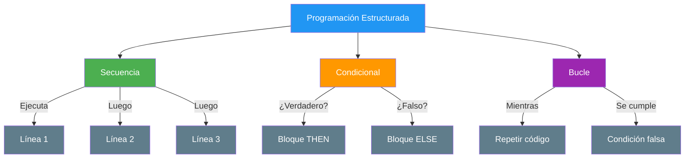

**Principio DRY (Don't Repeat Yourself)**:
Si ves que estás copiando y pegando el mismo bloque de código varias veces, es una señal de que necesitas una **estructura de control** (bucle) o un **módulo** (función). ¡Aplica DRY desde el primer día!

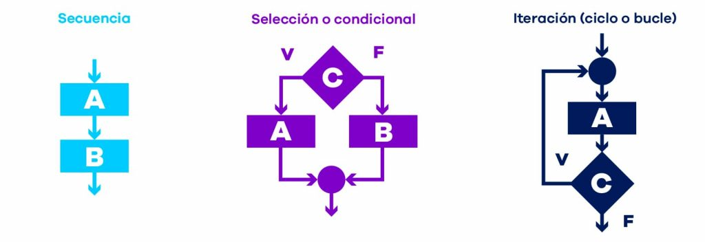

📌 **Ejemplo real:** Spotify usa secuencias para cargar tu playlist, condicionales para decidir si eres premium o free, y bucles para reproducir cada canción una tras otra. Sin estas estructuras, el código sería un caos imposible de mantener.

## 2.1. El Teorema de la Programación Estructurada

El teorema establece que cualquier programa "propio" (con un único punto de entrada y salida, sin bucles infinitos) puede escribirse usando **únicamente** estas tres estructuras. Esto significa que:

- **No necesitas `goto`** → las tres estructuras son suficientes
- **El código es predecible** → siempre sabes qué línea se ejecuta después
- **Es fácil de depurar** → puedes seguir el flujo paso a paso

```csharp
// Ejemplo: las tres estructuras juntas
Console.Write("Introduce tu edad: ");
int edad = int.Parse(Console.ReadLine()); // Secuencia

if (edad >= 18) // Condicional
{
    Console.WriteLine("Eres mayor de edad.");
}
else
{
    Console.WriteLine("Eres menor de edad.");
}

for (int i = 1; i <= 3; i++) // Bucle
{
    Console.WriteLine($"Intento {i}");
}
```

> 💡 **Consejo:** Piensa en el teorema como las piezas de Lego: con solo tres tipos de pieza puedes construir cualquier cosa. La clave está en cómo las combinas.

## 2.2. Secuencias

Es la estructura más simple. El programa ejecuta las instrucciones **de arriba hacia abajo**, una por una.

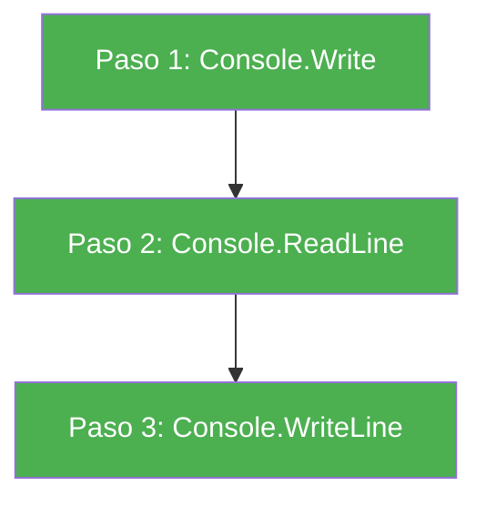

```csharp
// Ejemplo de Secuencia
Console.Write("¿Cómo te llamas? ");
string nombre = Console.ReadLine();

Console.Write("¿Cuántos años tienes? ");
int edad = int.Parse(Console.ReadLine());

Console.WriteLine($"Hola {nombre}, tienes {edad} años.");
// Se ejecuta línea a línea, sin saltos ni repeticiones
```

📌 **Ejemplo real:** Cuando abres Netflix, primero carga tu perfil (línea 1), luego muestra el catálogo (línea 2), después reproduce el vídeo seleccionado (línea 3). Es una secuencia perfecta.

## 2.3. Condicionales

Los condicionales permiten que nuestro programa **tome decisiones** y se comporte de manera diferente según las circunstancias.

### A. Condicional simple (`if`)

Evalúa una condición booleana. Si es `true`, ejecuta el bloque de código.

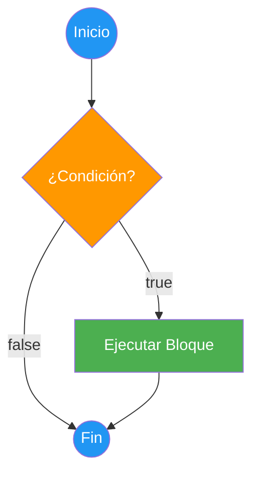

```csharp
Console.Write("Introduce tu edad: ");
int edad = int.Parse(Console.ReadLine());

if (edad >= 18)
{
    Console.WriteLine("Eres mayor de edad. Puedes votar.");
}
// Si edad < 18, simplemente no hace nada y continúa
```

📌 **Ejemplo real:** YouTube usa `if` para comprobar si tienes Premium: si es `true`, reproduce sin anuncios; si es `false`, muestra un anuncio primero.

### B. Condicional compuesto (`if-else`)

Ejecuta un bloque si se cumple la condición y **otro bloque** si no se cumple.

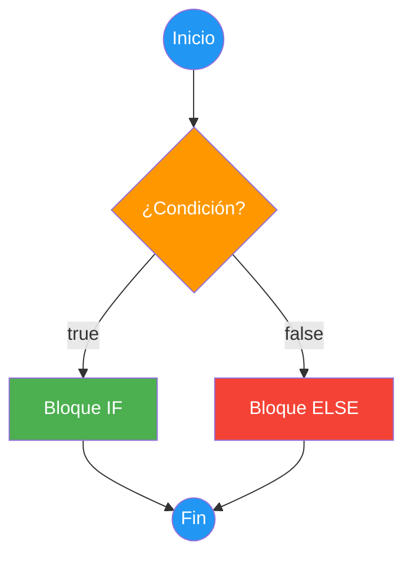

```csharp
Console.Write("Introduce tu edad: ");
int edad = int.Parse(Console.ReadLine());

if (edad >= 18)
{
    Console.WriteLine("Eres mayor de edad.");
}
else
{
    Console.WriteLine("Eres menor de edad.");
}
```

📌 **Ejemplo real:** Spotify decide si reproduces en calidad alta o normal: si eres premium → calidad alta; si no → calidad normal. Nunca ambas a la vez.

### C. Condicionales múltiples (`if-else if-else`)

Permite encadenar varias condiciones. Evalúa en orden y ejecuta la **primera que sea verdadera**.

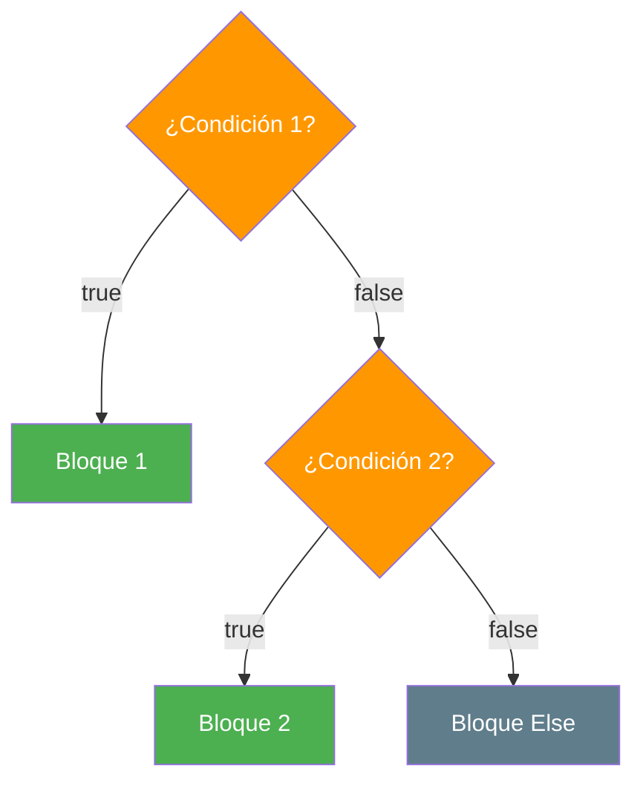

```csharp
Console.Write("Introduce tu nota (0-10): ");
double nota = double.Parse(Console.ReadLine());

if (nota >= 9)
{
    Console.WriteLine("Sobresaliente");
}
else if (nota >= 7)
{
    Console.WriteLine("Notable");
}
else if (nota >= 5)
{
    Console.WriteLine("Aprobado");
}
else
{
    Console.WriteLine("Suspenso");
}
```

> ⚠️ **Advertencia:** El orden importa. Si ponemos `if (nota >= 5)` antes que `if (nota >= 9)`, nunca llegaremos al sobresaliente porque el 9 cumple también `>= 5`. Evalúa siempre de mayor a menor.

📌 **Ejemplo real:** Amazon clasifica tus compras: si el gasto > 1000€ → cliente VIP; si > 500€ → cliente preferente; si > 100€ → cliente normal; si no → cliente nuevo.

### D. Estructura `switch`

Cuando necesitamos comparar **una única variable** contra múltiples valores, `switch` es más limpio que una cadena de `if-else if`.

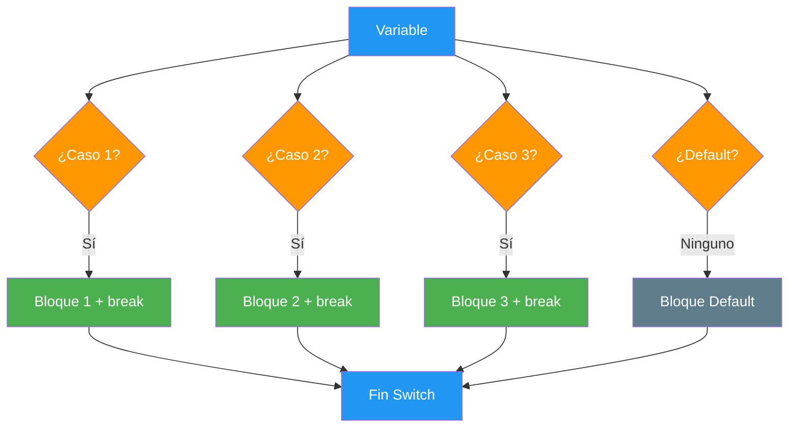

```csharp
Console.Write("Introduce el día de la semana (1-7): ");
int dia = int.Parse(Console.ReadLine());

string nombreDelDia;

switch (dia)
{
    case 1:
        nombreDelDia = "Lunes";
        break;
    case 2:
        nombreDelDia = "Martes";
        break;
    case 3:
        nombreDelDia = "Miércoles";
        break;
    case 4:
        nombreDelDia = "Jueves";
        break;
    case 5:
        nombreDelDia = "Viernes";
        break;
    case 6:
    case 7:
        nombreDelDia = "Fin de semana";
        break;
    default:
        nombreDelDia = "Día inválido";
        break;
}

Console.WriteLine($"Hoy es: {nombreDelDia}");
```

> ⚠️ **Advertencia:** En C#, cada `case` **debe** terminar con `break` (o `return`, `throw`). Si olvidas el `break`, el compilador da error. No hay "caída" automática como en otros lenguajes.

### E. Expresión `switch` moderna (C# 8+)

C# permite escribir `switch` como una **expresión** que devuelve un valor. Es más conciso:

```csharp
Console.Write("Introduce el día de la semana (1-7): ");
int dia = int.Parse(Console.ReadLine());

string nombreDelDia = dia switch
{
    1 => "Lunes",
    2 => "Martes",
    3 => "Miércoles",
    4 => "Jueves",
    5 => "Viernes",
    6 or 7 => "Fin de semana",
    _ => "Día inválido" // _ es el default
};

Console.WriteLine($"Hoy es: {nombreDelDia}");
```

Una de las técnicas más útiles para evitar errores en los condicionales es el uso de **paréntesis** para agrupar condiciones complejas:

```csharp
int edad = 20;
bool tieneDNI = true;

if ((edad >= 18) && (tieneDNI))
{
    Console.WriteLine("Puedes votar.");
}
else
{
    Console.WriteLine("No puedes votar.");
}
```

### F. Operador ternario `? :`

Como viste en la UD01, el operador ternario es una forma **reducida** del `if-else` que devuelve un valor. Es útil para asignaciones simples:

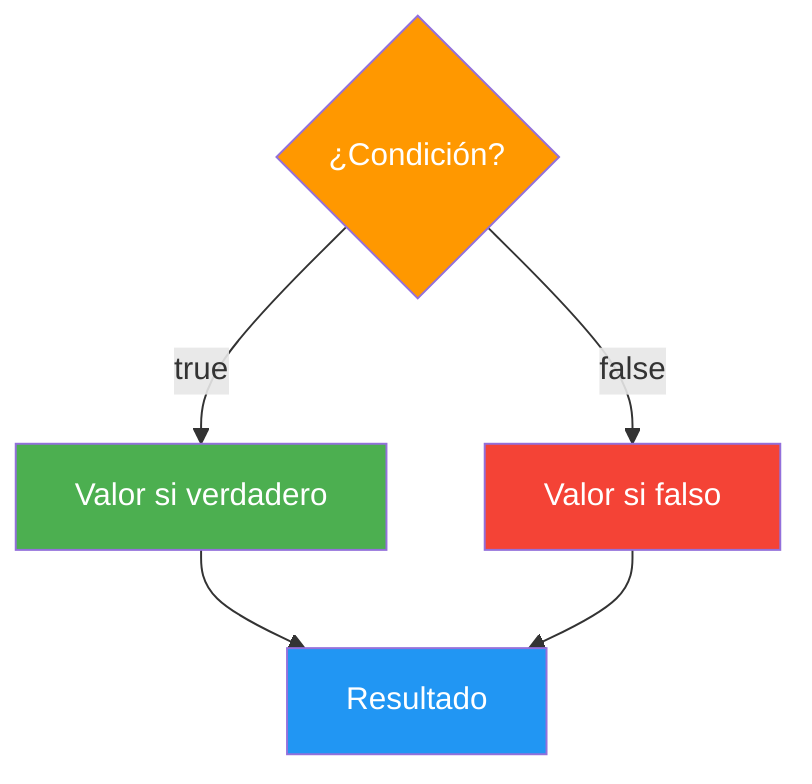

```csharp
int edad = 20;

// Con if-else (verboso)
string mensaje;
if (edad >= 18)
{
    mensaje = "Mayor de edad";
}
else
{
    mensaje = "Menor de edad";
}

// Con ternario (conciso) — lo vimos en UD01
string mensaje2 = edad >= 18 ? "Mayor de edad" : "Menor de edad";

Console.WriteLine(mensaje2); // Mayor de edad
```

> 💡 **Consejo:** Usa el ternario cuando la asignación sea simple (una línea). Si la lógica es compleja (varias condiciones, efectos secundarios), usa `if-else` normal.

### G. Operador de coalescencia `??`

También lo viste en la UD01: `??` proporciona un **valor por defecto** si una variable es `null`. Es como un `if` compacto para la nulidad:

```csharp
string? nombre = null;

// Con if-else
string nombreSeguro;
if (nombre != null)
{
    nombreSeguro = nombre;
}
else
{
    nombreSeguro = "Desconocido";
}

// Con ?? (conciso)
string nombreSeguro2 = nombre ?? "Desconocido";

Console.WriteLine(nombreSeguro2); // Desconocido
```

También existe `??=` que asigna un valor **solo si** la variable es `null`:

```csharp
string? nombre = null;
nombre ??= "Visitante"; // Si es null, asigna "Visitante"
Console.WriteLine(nombre); // Visitante

nombre ??= "Otro"; // Ya no es null, no cambia
Console.WriteLine(nombre); // Sigue siendo Visitante
```

📌 **Ejemplo real:** Netflix usa `??` para mostrar "Sin descripción" cuando una serie no tiene sinopsis: `sinopsis ?? "Sin descripción"`.

> 💡 **Truco:** Usa `switch` cuando compares una variable contra valores concretos. Usa `if-else if` cuando las condiciones sean expresiones complejas (rangos, operadores lógicos).

## 2.4. Bucles

Los bucles nos permiten **repetir** un bloque de código varias veces, ahorrándonos escribir la misma lógica una y otra vez.

📌 **Ejemplo real:** TikTok usa bucles para cargar tu feed: mientras haya vídeos nuevos, los muestra uno tras otro. Cuando te quedas sin contenido, el bucle para.

### A. Bucle `while`

Evalúa la condición **antes** de cada iteración. Si la condición es `false` al inicio, **nunca se ejecuta**.

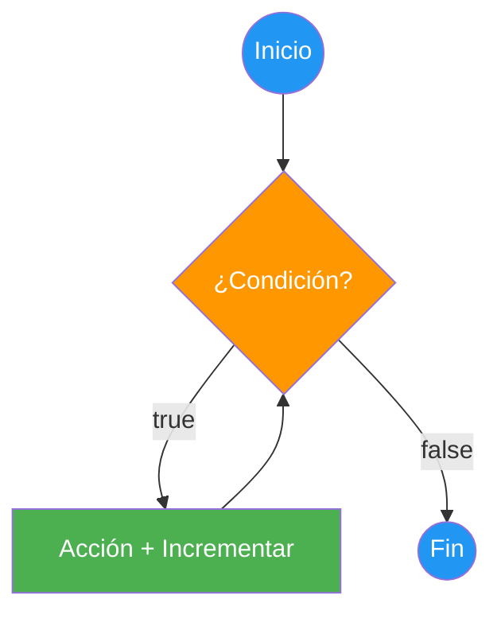

```csharp
int contador = 0;
while (contador < 5)
{
    Console.WriteLine($"Contador: {contador}");
    contador++;  // ¡Importante! Sin esto, bucle infinito
}
// Salida: 0, 1, 2, 3, 4
```

### B. Bucle `do-while`

Evalúa la condición **después** de cada iteración. Garantiza **al menos una ejecución**.

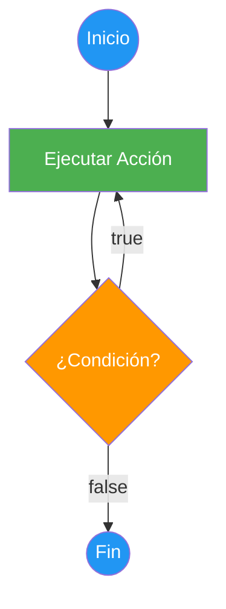

```csharp
string opcion;

do
{
    Console.WriteLine("=== MENÚ ===");
    Console.WriteLine("1. Ver perfil");
    Console.WriteLine("2. Configuración");
    Console.WriteLine("3. Salir");
    Console.Write("Opción: ");
    opcion = Console.ReadLine();

    Console.WriteLine($"Seleccionaste: {opcion}");
} while (opcion != "3");

Console.WriteLine("¡Hasta luego!");
```

> 💡 **Consejo:** `do-while` es perfecto para menús: siempre quieres mostrar el menú al menos una vez, sin importar qué elija el usuario.

### C. Bucle `for`

Los bucles `for` se usan cuando **sabemos cuántas veces** queremos repetir. Incluye inicialización, condición e incremento en una sola línea.

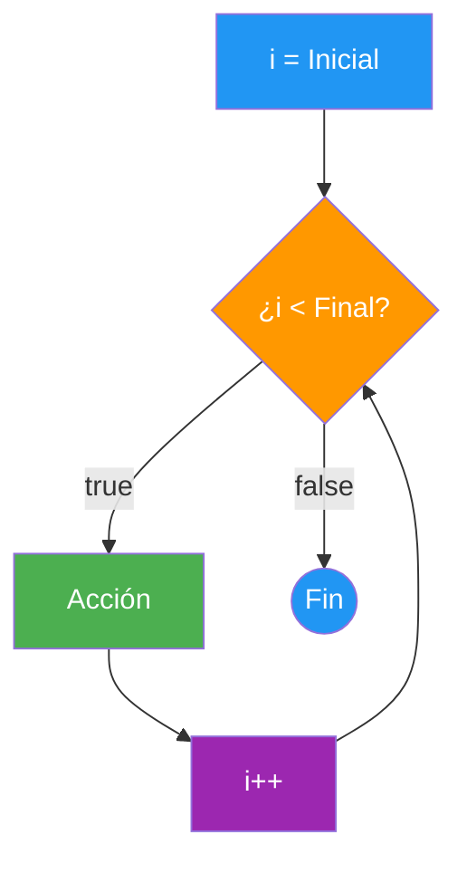

```csharp
// Ascendente: de 0 a 5
for (int i = 0; i <= 5; i++)
{
    Console.WriteLine(i); // 0, 1, 2, 3, 4, 5
}

// Descendente: de 5 a 0
for (int i = 5; i >= 0; i--)
{
    Console.WriteLine(i); // 5, 4, 3, 2, 1, 0
}

// De 2 en 2
for (int i = 0; i <= 10; i += 2)
{
    Console.WriteLine(i); // 0, 2, 4, 6, 8, 10
}
```

> 💡 **Truco nemotécnico:**
> - **`for`** = **F**ijo → sabes cuántas veces
> - **`while`** = **W**hile → mientras se cumpla, repite
> - **`do-while`** = **D**o → hacer al menos una vez

### D. Bucle `foreach`

Recorre automáticamente todos los elementos de una colección (array, lista, etc.). No necesitas controlar el índice.

```csharp
string[] frutas = { "Manzana", "Plátano", "Naranja", "Fresa" };

foreach (string fruta in frutas)
{
    Console.WriteLine($"Fruta: {fruta}");
}
// Salida: Manzana, Plátano, Naranja, Fresa
```

> 📝 **Nota:** `foreach` es ideal para recorrer arrays. Lo verás en detalle en la UD03 cuando estudiemos arrays y matrices.

### E. Comparativa de bucles

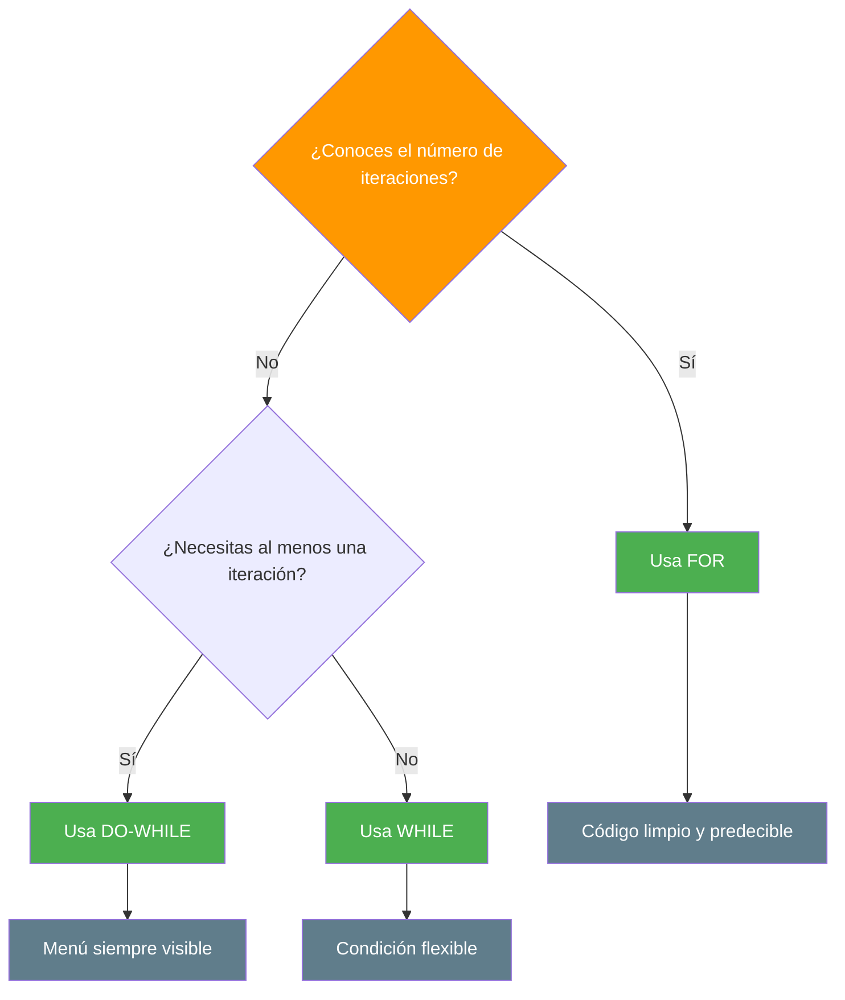

**Comparativa visual con código:**

```csharp
// WHILE: Evalúa ANTES de ejecutar (puede no ejecutarse nunca)
int i = 0;
while (i < 3)
{
    Console.WriteLine($"while: {i}");
    i++;
}
// Salida: while: 0, while: 1, while: 2

// DO-WHILE: Evalúa DESPUÉS de ejecutar (siempre se ejecuta al menos una vez)
int j = 0;
do
{
    Console.WriteLine($"do-while: {j}");
    j++;
} while (j < 3);
// Salida: do-while: 0, do-while: 1, do-while: 2

// FOR: Todo junto (inicialización, condición, incremento)
for (int k = 0; k < 3; k++)
{
    Console.WriteLine($"for: {k}");
}
// Salida: for: 0, for: 1, for: 2
```

## 2.5. Mecanismos de Control de Bucles

Existen **tres formas típicas** de controlar cuándo se ejecuta un bucle:

### A. Bucles controlados por Indicadores (Banderas o Flags)

Las **banderas** son variables booleanas (`bool`) que controlan la ejecución del bucle.

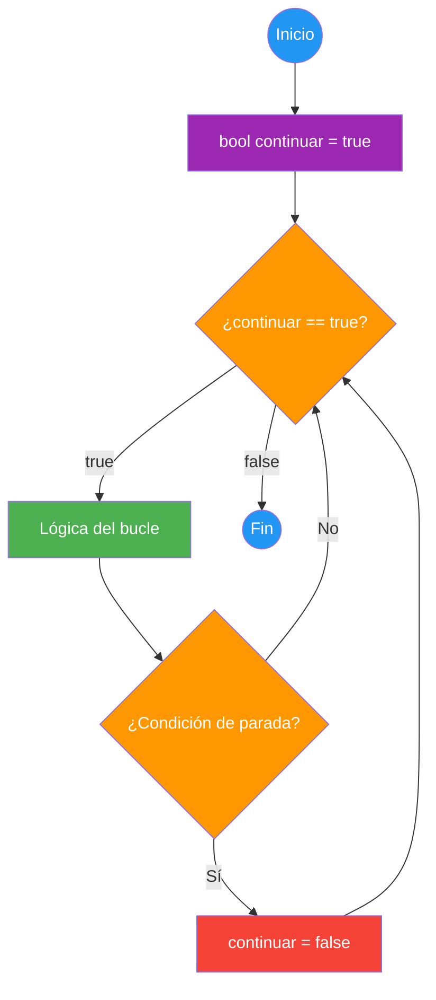

```csharp
// Ejemplo: Determinar si un número contiene solo cifras menores que 5
bool menor;
int num;

Console.Write("Introduce un número: ");
num = int.Parse(Console.ReadLine());

menor = true; // Inicialización del indicador

while (menor && (num > 0))
{
    if (num % 10 >= 5)
    {
        menor = false; // Cambiamos la bandera
    }
    num = num / 10; // Eliminamos la última cifra
}

if (menor)
{
    Console.WriteLine("Todas las cifras son menores que 5");
}
else
{
    Console.WriteLine("Hay alguna cifra mayor o igual que 5");
}
```

### B. Bucles controlados por Centinela

Un **centinela** es un valor especial que indica la parada de la iteración.

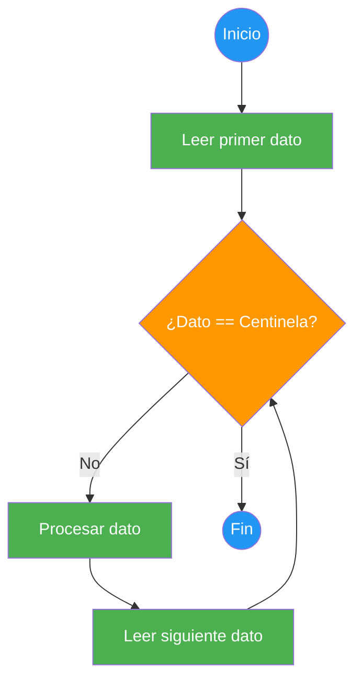

```csharp
// Sumar números hasta que se introduce 0 (centinela)
int suma = 0;
int num;

Console.Write("Introduce números a sumar, 0 para acabar: ");
num = int.Parse(Console.ReadLine());

while (num != 0)
{
    suma += num;
    Console.Write("Introduce números a sumar, 0 para acabar: ");
    num = int.Parse(Console.ReadLine());
}

Console.WriteLine($"Suma total: {suma}");
```

### C. Bucles Anidados

Los bucles se pueden **anidar** (un bucle dentro de otro). Especialmente útil para matrices.

```csharp
// Generar tabla de multiplicar (1 a 10)
for (int i = 1; i <= 10; i++)
{
    for (int j = 1; j <= 10; j++)
    {
        Console.Write($"{i * j,4}");
    }
    Console.WriteLine();
}
```

> 📝 **Nota:** Los arrays bidimensionales (matrices) y su manipulación con bucles anidados se estudiarán en la UD03.

## 2.6. Sentencias de Salto

Las sentencias de salto permiten alterar el flujo normal de un bucle.

### A. `break`

**Sale completamente** del bucle más cercano. Se usa cuando se ha encontrado lo que buscabas.

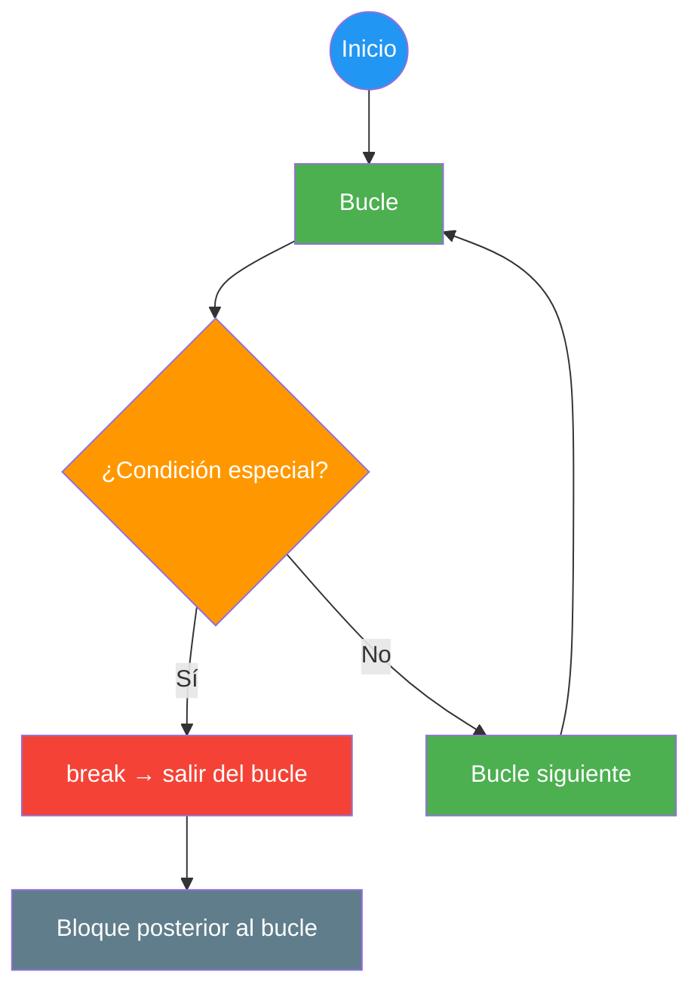

```csharp
// Buscar un número en una lista
int[] numeros = { 5, 12, 8, 23, 1, 9 };
int objetivo = 23;

for (int i = 0; i < numeros.Length; i++)
{
    if (numeros[i] == objetivo)
    {
        Console.WriteLine($"Encontrado {objetivo} en posición {i}");
        break; // No necesitamos seguir buscando
    }
}
// Salida: Encontrado 23 en posición 3
```

### B. `continue`

**Salta** a la siguiente iteración del bucle, sin ejecutar el código que queda en la iteración actual.

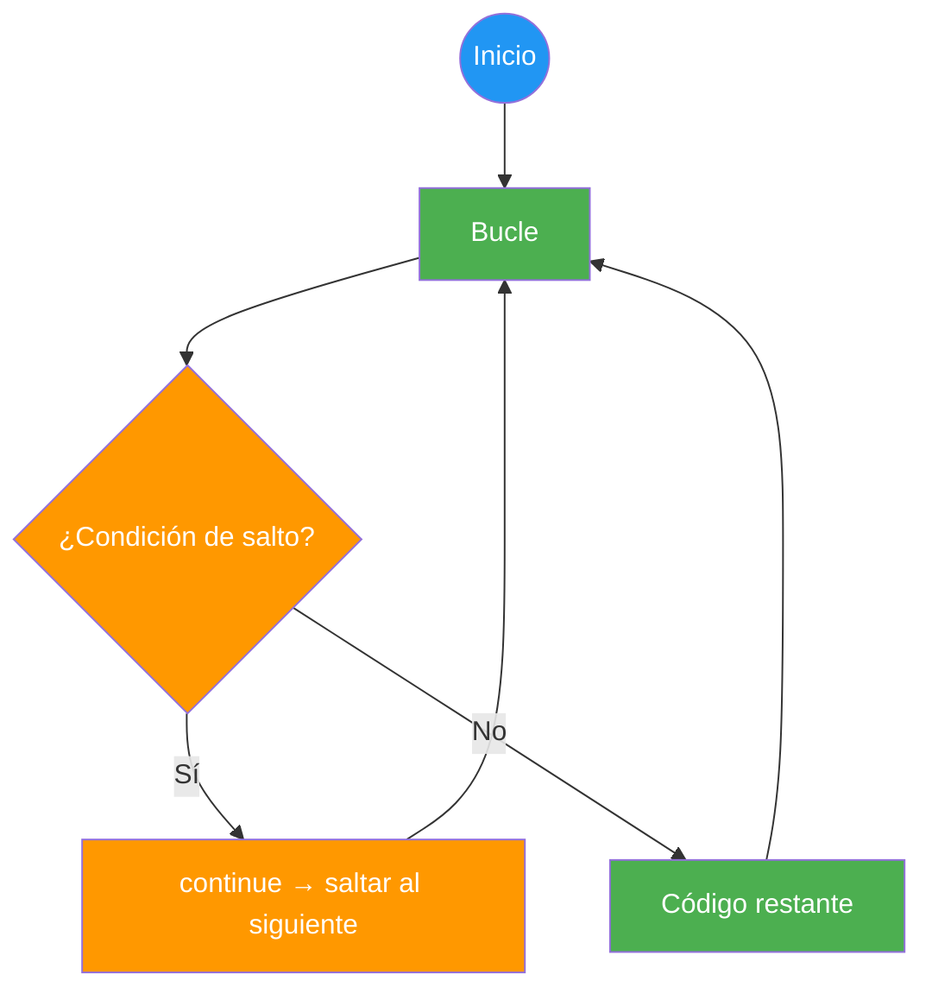

```csharp
// Mostrar solo números pares
for (int i = 1; i <= 10; i++)
{
    if (i % 2 != 0)
    {
        continue; // Saltar impares
    }
    Console.WriteLine($"{i} es par");
}
// Salida: 2 es par, 4 es par, 6 es par, 8 es par, 10 es par
```

> ⚠️ **Advertencia:** Usa `break` y `continue` con moderación. Un uso excesivo dificulta la legibilidad. Si tu bucle necesita muchos `break`/`continue`, probablemente necesite reestructurarse.

## 2.7. Peligros: El Bucle Infinito

Un bucle infinito ocurre cuando la condición de salida **nunca se vuelve falsa**.

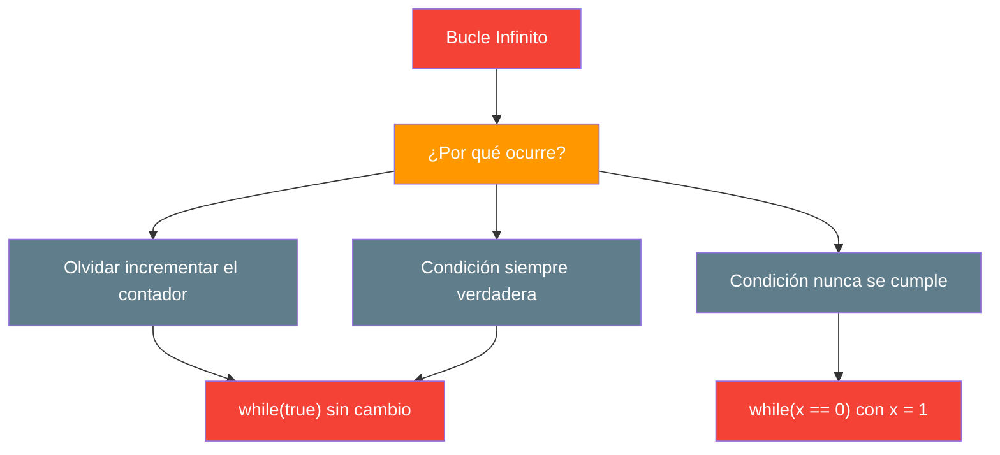

```csharp
// ❌ ERROR: Bucle infinito — olvidaste incrementar
int contador = 0;
while (contador < 10)
{
    Console.WriteLine(contador);
    // contador NUNCA cambia → bucle infinito
}

// ✅ CORRECTO
int contador = 0;
while (contador < 10)
{
    Console.WriteLine(contador);
    contador++;  // ¡Importante!
}

// ❌ ERROR: Condición siempre verdadera
while (true)  // Nunca sale
{
    // ...
}

// ❌ ERROR: Condición que nunca se cumple
int opcion = 0;
while (opcion == 5)  // Si opcion empieza en 0, nunca entra
{
    // ...
}
```

> 💡 **Consejo:** Antes de ejecutar un bucle, hazte la pregunta: **"¿Cómo sale este bucle?"** Si no tienes respuesta, tienes un bucle infinito.

> 📝 **Tip de depuración:** Si tu programa se queda "colgado", probablemente tienes un bucle infinito. Usa el depurador del IDE para pausar y ver el valor de las variables de control.

## 2.8. Depuración: Aserciones y Técnicas

La **depuración** es el proceso de encontrar y corregir errores en el código. Existen varias técnicas:

### Depurador del IDE

La forma más efectiva es usar el **depurador** de tu IDE (JetBrains Rider o VS Code):

1. Pone un **punto de interrupción** (breakpoint) en la línea sospechosa
2. Ejecuta en modo depuración
3. Inspecciona el valor de las variables en tiempo real
4. Avanza línea a línea (`Step Over`) o entra en funciones (`Step Into`)

### Impresión de depuración

A veces no tienes depurador o es más rápido un `Console.WriteLine`:

```csharp
int[] numeros = { 5, 12, 8, 23, 1 };

for (int i = 0; i < numeros.Length; i++)
{
    Console.WriteLine($"DEBUG: i={i}, numeros[i]={numeros[i]}"); // Depuración
    if (numeros[i] == 23)
    {
        Console.WriteLine("¡Encontrado!");
        break;
    }
}
```

### Depuración con Visual Studio / Rider

```csharp
// Los IDEs muestran el valor de las variables al pasar el cursor
for (int i = 0; i < 5; i++)
{
    int cuadrado = i * i; // ← Al depurar, el IDE muestra i=0, cuadrado=0
    Console.WriteLine($"{i}² = {cuadrado}");
}
```

> 💡 **Consejo:** Aprende a usar el depurador de tu IDE. Es la herramienta más poderosa que tiene un programador. Más rápida y precisa que cualquier `Console.WriteLine`.

📌 **Ejemplo real:** Los desarrolladores de Netflix usan el depurador para encontrar por qué un vídeo se congela: ponen un breakpoint en el bucle de reproducción, inspeccionan la memoria y detectan que el buffer se llenó.
