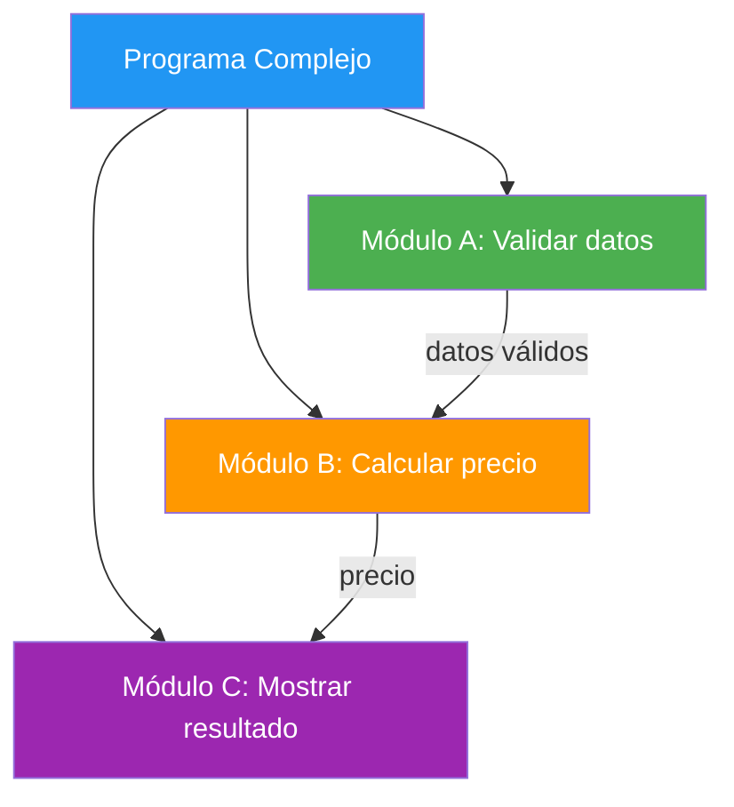
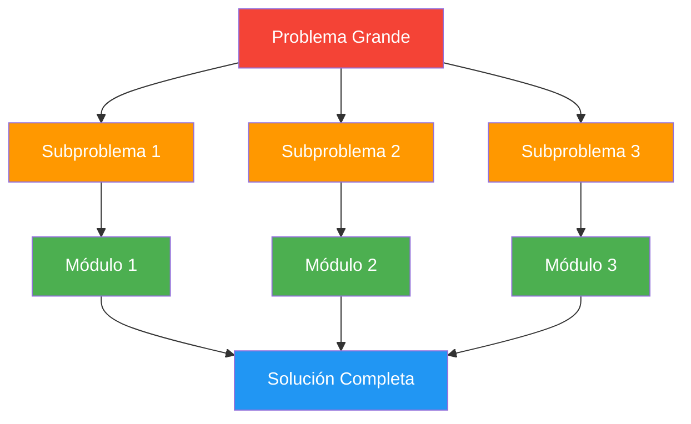
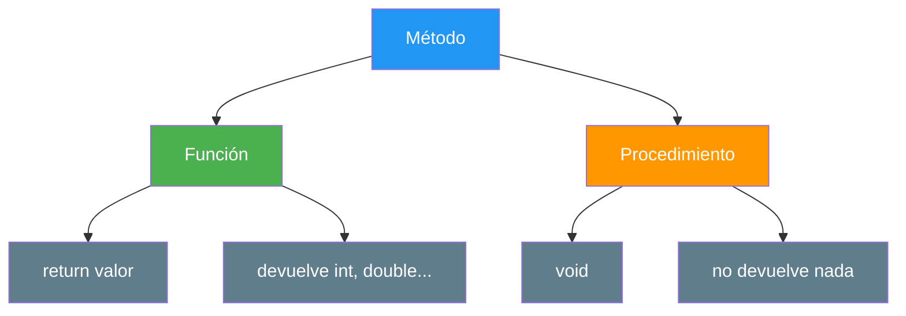
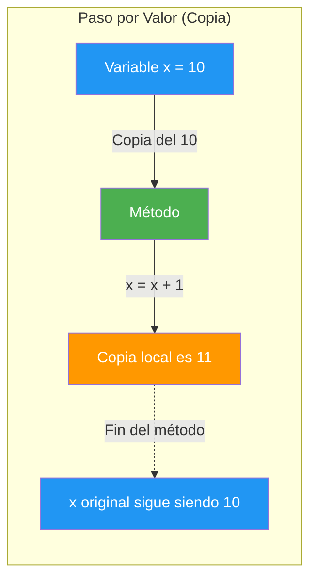
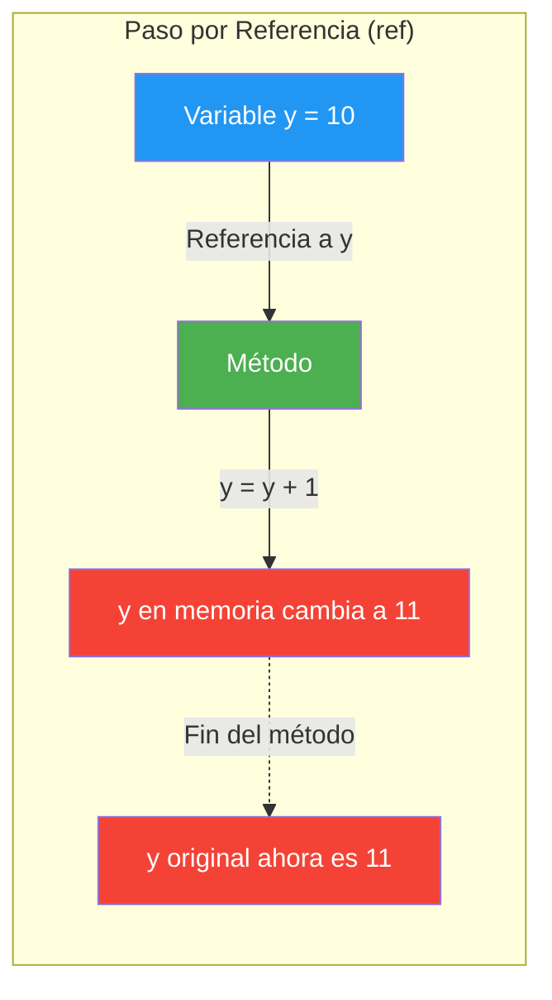
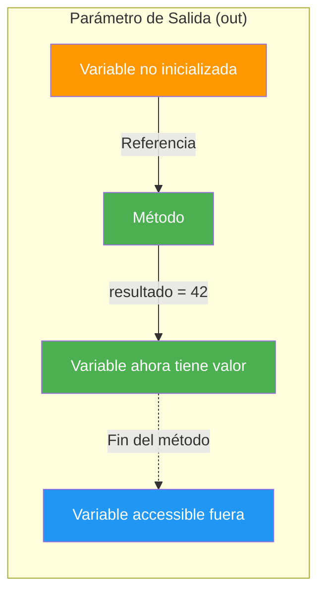
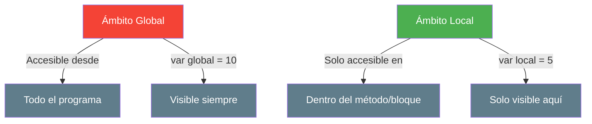
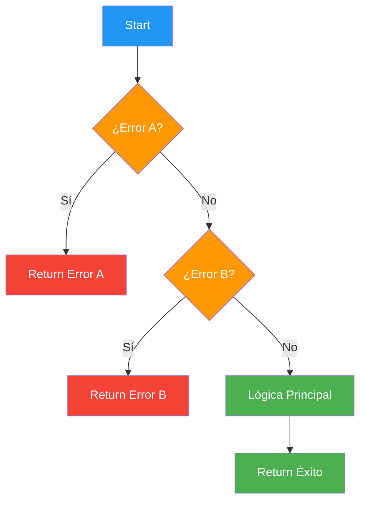
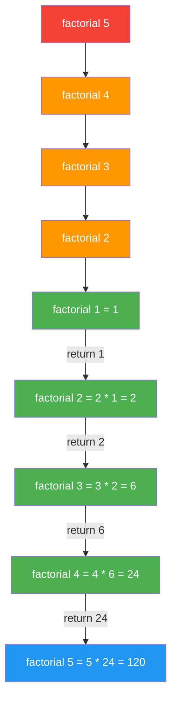
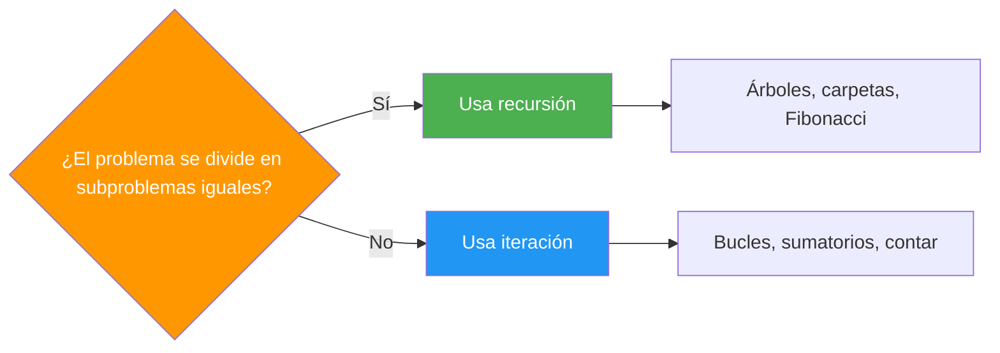

- [3. Programación Modular](#3-programación-modular)
  - [3.1. ¿Por qué dividir en módulos?](#31-por-qué-dividir-en-módulos)
  - [3.2. Funciones y Procedimientos en C#](#32-funciones-y-procedimientos-en-c)
    - [A. Funciones (devuelven valor)](#a-funciones-devuelven-valor)
    - [B. Procedimientos (no devuelven valor)](#b-procedimientos-no-devuelven-valor)
    - [C. Diferencia entre función y procedimiento](#c-diferencia-entre-función-y-procedimiento)
  - [3.3. Parámetros y Argumentos](#33-parámetros-y-argumentos)
    - [A. Paso por valor (por defecto)](#a-paso-por-valor-por-defecto)
    - [B. Paso por referencia con `ref`](#b-paso-por-referencia-con-ref)
    - [C. Parámetros de salida con `out`](#c-parámetros-de-salida-con-out)
    - [D. Paso solo lectura con `in`](#d-paso-solo-lectura-con-in)
    - [E. Parámetros variables con `params`](#e-parámetros-variables-con-params)
    - [F. Resumen de modificadores de parámetros](#f-resumen-de-modificadores-de-parámetros)
    - [G. Menciones avanzadas: `this`, `scoped`, `ref readonly`](#g-menciones-avanzadas-this-scoped-ref-readonly)
  - [3.4. Ámbito de las variables](#34-ámbito-de-las-variables)
  - [3.5. Parámetros por defecto, opcionales y nombrados](#35-parámetros-por-defecto-opcionales-y-nombrados)
  - [3.6. Sobrecarga de funciones](#36-sobrecarga-de-funciones)
  - [3.7. Early Return para simplificar condicionales](#37-early-return-para-simplificar-condicionales)
  - [3.8. Recursividad](#38-recursividad)
  - [3.9. Espacios de nombres y `using`](#39-espacios-de-nombres-y-using)


# 3. Programación Modular

> 💡 **Punto de partida:** ¿Alguna vez has construido algo con LEGO? Cada pieza es pequeña, sencilla y tiene una función clara. Juntas, construyen cualquier cosa. La programación modular es lo mismo: dividir un programa grande en piezas pequeñas, manejables y reutilizables.

La **programación modular** consiste en dividir un programa en partes más pequeñas llamadas **módulos**. En C#, estos módulos se implementan como **funciones** y **procedimientos** (también llamados **métodos**).



📌 **Ejemplo real:** Netflix no tiene un solo programa gigante. Tiene módulos separados: uno para el catálogo, otro para la reproducción, otro para las recomendaciones, otro para la facturación. Si cambia el algoritmo de recomendaciones, no toca los demás.

**Ventajas de la modularidad:**

- **Claridad**: cada módulo hace una cosa y la hace bien
- **Reutilización**: una función puede usarse en muchos sitios
- **Mantenimiento**: si hay un bug, solo arreglas un módulo
- **Trabajo en equipo**: cada programador trabaja en módulos diferentes
- **Testing**: puedes probar cada módulo por separado

## 3.1. ¿Por qué dividir en módulos?

La técnica fundamental es **"Divide y Vencerás" (DAC)**:



**Pasos de la descomposición modular:**

1. **Análisis**: Comprender el problema
2. **Identificación**: Dividir en subproblemas
3. **Diseño**: Crear módulos para cada subproblema
4. **Implementación**: Codificar cada módulo
5. **Pruebas**: Probar cada módulo individualmente

**Principio SRP (Single Responsibility Principle):**
Cada módulo debe tener **una única responsabilidad**. Si una función calcula el IVA y también lo imprime, está haciendo dos cosas. Sepáralas.

> 💡 **Consejo:** Si no puedes describir qué hace una función en una frase corta sin usar "y", probablemente está haciendo demasiado. Divídela.

## 3.2. Funciones y Procedimientos en C#

En C#, los módulos se llaman **métodos**. Hay dos tipos:

### A. Funciones (devuelven valor)

Una **función** realiza una tarea y **devuelve un resultado** mediante `return`.

```csharp
// Función que calcula el área de un rectángulo
double CalcularArea(double largo, double ancho)
{
    return largo * ancho;
}

// Uso
double area = CalcularArea(5.0, 3.0);
Console.WriteLine($"Área: {area}"); // Área: 15
```


📌 **Ejemplo real:** Spotify tiene una función `CalcularDuracionPlaylist()` que recibe una lista de canciones y devuelve la duración total. Esa función se llama cada vez que abres una playlist.

### B. Procedimientos (no devuelven valor)

Un **procedimiento** realiza una tarea pero **no devuelve nada**. Usa `void` como tipo de retorno.

```csharp
// Procedimiento que muestra un saludo
void Saludar(string nombre)
{
    Console.WriteLine($"¡Hola, {nombre}! Bienvenido.");
}

// Uso
Saludar("Ana"); // ¡Hola, Ana! Bienvenido.
```

### C. Diferencia entre función y procedimiento



| Característica | Función | Procedimiento |
|---------------|---------|---------------|
| **Tipo de retorno** | Cualquier tipo (`int`, `double`, `string`...) | `void` |
| **`return`** | Obligatorio (devuelve un valor) | Opcional (sale del método) |
| **Uso típico** | Calcular, obtener, validar | Mostrar, guardar, actualizar |
| **Ejemplo** | `int Sumar(int a, int b)` | `void MostrarMensaje(string msg)` |

> 📝 **Nota:** En C# ambos se llaman "métodos". La distinción función/procedimiento es conceptual para entender si devuelven o no un valor.

## 3.3. Parámetros y Argumentos

Los **parámetros** son las variables de la definición del método. Los **argumentos** son los valores reales que pasas al llamarlo.

```csharp
// "nombre" y "edad" son PARÁMETROS
void MostrarInfo(string nombre, int edad)
{
    Console.WriteLine($"{nombre} tiene {edad} años");
}

// "Ana" y 25 son ARGUMENTOS
MostrarInfo("Ana", 25);
```

Ahora vamos con los **modificadores de parámetros** que controlan cómo se pasan los datos.

### A. Paso por valor (por defecto)

Cuando pasas un argumento **por valor**, la función recibe una **copia** del dato original. Cualquier modificación **no afecta** a la variable original.



```csharp
void Incrementar(int numero)
{
    numero = numero + 1; // Modifica la COPIA, no el original
    Console.WriteLine($"Dentro del método: {numero}"); // 11
}

int valorOriginal = 10;
Incrementar(valorOriginal);
Console.WriteLine($"Fuera del método: {valorOriginal}"); // Sigue siendo 10
```

> 💡 **Analogía:** Imagina que le das a un amigo una **fotocopia** de tu examen para que lo revise. Él escribe notas al margen, tacha cosas, añade comentarios... Pero tu examen original **no cambia**. Eso es el paso por valor: el método recibe una copia, puede hacer lo que quiera con ella, pero el original queda intacto.

> 💡 **Analogía 2:** Es como cocinar una receta. Le pasas a tu amigo los ingredientes (harina, huevos, azúcar). Él hace su propio pastel. Pero si lees la receta, tú tienes tus propios ingredientes intactos. Cada uno trabaja con su propia "copia" de los ingredientes.

**Ejemplo extra: ¿Y con strings?**

```csharp
void IntentarCambiar(string texto)
{
    texto = "Modificado";  // Crea un string nuevo, NO modifica el original
    Console.WriteLine($"Dentro: {texto}");  // "Modificado"
}

string original = "Hola";
IntentarCambiar(original);
Console.WriteLine($"Fuera: {original}");  // Sigue siendo "Hola"
```

📌 **Ejemplo real:** Piensa en Netflix. Cuando seleccionas una película, la app recibe los datos de la película (título, duración, sinopsis). Si internamente modifica algo temporalmente para mostrarla en una lista diferente, eso **no afecta** a la película original en la base de datos. Trabaja con copias seguras.

### B. Paso por referencia con `ref`

`ref` pasa la **dirección de memoria** de la variable. Cualquier cambio **modifica el original**.



```csharp
void Duplicar(ref int numero)
{
    numero = numero * 2; // Modifica el original DIRECTAMENTE
}

int valorOriginal = 10;
Console.WriteLine($"Antes: {valorOriginal}"); // 10
Duplicar(ref valorOriginal);
Console.WriteLine($"Después: {valorOriginal}"); // 20
```

> 💡 **Analogía:** Ahora en vez de una fotocopia, le das a tu amigo **la llave de tu casa**. Cuando él entra y mueve los muebles, reorganiza la cocina o cambia las sábanas... tú sales y ves **tu casa realmente cambiada**. No es una copia, es la misma casa. Eso es `ref`: el método trabaja directamente con tu variable original.

> 💡 **Analogía 2:** Es como un documento de Google Docs compartido. Tú y tu amigo编辑áis el mismo documento al mismo tiempo. Cuando él escribe un párrafo, tú lo ves en tu pantalla porque **es el mismo documento**, no una copia.

```csharp
// ¿Qué pasa sin ref? Mira la diferencia:
void SinRef(int numero)
{
    numero = 999;  // Solo cambia la copia
}

void ConRef(ref int numero)
{
    numero = 999;  // Cambia el original
}

int valor = 10;
SinRef(valor);
Console.WriteLine($"Sin ref: {valor}");   // 10 (no cambió)

ConRef(ref valor);
Console.WriteLine($"Con ref: {valor}");   // 999 (¡cambió!)
```


**¿Cuándo usar cada uno?**

- **Paso por valor** (por defecto): cuando la función solo necesita leer el dato, no modificarlo. Es seguro y predecible.
- **Paso por `ref`**: cuando necesitas que la función modifique la variable original (intercambio, acumulación, etc.).

> ⚠️ **Regla obligatoria:** Si el parámetro pide `ref`, **debes** escribir `ref` también al llamar. Es una señal explícita de que el método puede modificar tu variable. Es como decir: "te doy la llave de mi casa, pero quiero que seas consciente de que puedes cambiarla".

**Uso típico: intercambiar dos valores**

```csharp
void Intercambiar(ref int a, ref int b)
{
    int temporal = a;
    a = b;
    b = temporal;
}

int num1 = 10;
int num2 = 20;
Intercambiar(ref num1, ref num2);
Console.WriteLine($"num1: {num1}, num2: {num2}"); // num1: 20, num2: 10
```

> 💡 **Analogía del intercambio:** Es como si dos jugadores de baloncesto intercambian sus camisetas. Si solo le dieras una fotocopia de tu camiseta a tu compañero, él tendría una copia, pero tú seguirías con la tuya. Con `ref`, es como si literalmente os quitáis las camisetas y os las ponéis: el cambio es REAL.

📌 **Ejemplo real:** Un juego necesita actualizar la posición del jugador. Si la función solo recibe una copia, el jugador no se mueve. Con `ref`, la posición se actualiza directamente.

📌 **Ejemplo real 2:** En un juego multijugador como Fortnite, cuando un jugador recoge un objeto, la función `RecogerObjeto(ref inventario, ref monedas)` modifica directamente el inventario y las monedas del jugador. Si fuera por valor, el jugador recogería el objeto pero su inventario real no cambiaría.

### C. Parámetros de salida con `out`

`out` se usa cuando un método debe **devolver múltiples valores**. A diferencia de `ref`:

- La variable **no necesita estar inicializada** antes de la llamada
- El método **está obligado** a asignarle un valor antes de terminar



```csharp
bool IntentarDividir(int num, int den, out decimal resultado)
{
    if (den == 0)
    {
        resultado = 0; // DEBES asignar un valor aunque sea error
        return false;
    }
    resultado = (decimal)num / den;
    return true;
}

// Uso: la variable "resultado" no necesita inicialización
if (IntentarDividir(10, 3, out decimal resultado))
{
    Console.WriteLine($"Resultado: {resultado:F2}"); // 3.33
}
else
{
    Console.WriteLine("No se puede dividir por cero");
}
```

> 💡 **Analogía:** Imagina que rellenas un formulario en una oficina. Tú llegas con el formulario **en blanco** (la variable no inicializada). El funcionario (`out`) lo rellena por ti y te lo devuelve. Tú no rellenas nada antes — él **está obligado** a rellenarlo todo antes de devolvértelo. Si no lo rellena, el formulario no sirve.

> 💡 **Analogía 2:** Es como ir a un restaurante y pedir un plato. Tú no sabes cuánto va a costar (variable no inicializada). El camarero trae la cuenta (`out resultado`). Tú no pagas nada antes de ver la cuenta — el camarero **está obligado** a ponerte el precio antes de irse.

```csharp
// Ejemplo extra: TryParse con out
string entrada = "42";
string malaEntrada = "abc";

// TryParse NO lanza excepción — usa out para devolver el resultado
bool esNumero = int.TryParse(entrada, out int resultado);
Console.WriteLine($"¿'{entrada}' es número? {esNumero}, valor: {resultado}"); // true, 42

bool esNumero2 = int.TryParse(malaEntrada, out int resultado2);
Console.WriteLine($"¿'{malaEntrada}' es número? {esNumero2}, valor: {resultado2}"); // false, 0
```

📌 **Ejemplo real:** `int.TryParse("123", out int valor)` es exactamente como una calculadora: tú introduces algo, la calculadora intenta convertirlo a número y te devuelve el resultado. Si no puede, te dice "error" pero no se rompe.

> ⚠️ **Importante:** La variable `out` **no necesita valor inicial**, pero el método **debe asignarle uno SIEMPRE**. Es como el formulario: no llega vacío, pero el funcionario debe rellenarlo todo.

| Característica | `ref` (Referencia) | `out` (Salida) |
|---------------|-------------------|----------------|
| **Inicialización** | Obligatoria antes de llamar | No necesaria |
| **Asignación en método** | Opcional | **Obligatoria** |
| **Flujo de datos** | Entrada y Salida | Solo Salida |
| **Analogía** | Llave de tu casa | Formulario en blanco |

### Tuplas: devolver múltiples valores de forma moderna

A veces necesitas que una función devuelva **varios valores**. Antes usábamos `out`, pero las **tuplas** son más limpias y legibles.

> 💡 **Analogía:** Si `out` es como rellenar un formulario en blanco, una **tupla** es como pedir una **caja combo** en un restaurante: recibes una caja que contiene（主食, postre y bebida）todos juntos, y puedes sacar cada cosa por su nombre.

```csharp
// ✅ Con tupla: legible y directo
(string nombre, int edad, double nota) ObtenerAlumno()
{
    return ("Ana", 20, 8.5);
}

var alumno = ObtenerAlumno();
Console.WriteLine($"{alumno.nombre} tiene {alumno.edad} años y sacó {alumno.nota}");

// ✅ Desestructurar
var (nombre, edad, nota) = ObtenerAlumno();
Console.WriteLine($"{nombre}: {nota}");
```

```csharp
// ❌ Sin tupla: verboso (usando out)
void ObtenerAlumno(out string nombre, out int edad, out double nota)
{
    nombre = "Ana";
    edad = 20;
    nota = 8.5;
}

// Llamada incómoda
ObtenerAlumno(out string nombre, out int edad, out double nota);
Console.WriteLine($"{nombre}: {nota}");
```

| Característica | `out` | Tupla |
| :--- | :--- | :--- |
| **Legibilidad** | Verboso | Conciso y claro |
| **Inicialización** | No necesita | Se devuelve directa |
| **Nombres** | Parámetros separados | Campos con nombre |
| **Uso típico** | `TryParse`, validar | Devolver resultados de cálculos |

> 📝 **Nota:** Las tuplas se usan mucho en la práctica cuando una función necesita devolver 2-3 valores. Para más valores, es mejor crear una clase o record.

#### Descarte con `_`

Si solo te interesa **uno** de los valores de la tupla, usa `_` para ignorar el resto:

```csharp
(string nombre, _, double nota) = ("Ana", 20, 8.5);
Console.WriteLine($"{nombre}: {nota}");  // Ana: 8.5

// En TryParse (muy habitual)
string input = "42";
if (int.TryParse(input, out int resultado))
{
    Console.WriteLine(resultado);  // 42
}
```

#### Igualdad de tuplas

Las tuplas comparan **por valores**, no por nombres. Funcionan con `==` y `!=`:

```csharp
var t1 = (A: 5, B: 10);
var t2 = (B: 5, A: 10);
Console.WriteLine(t1 == t2);  // True — orden posicional, nombres irrelevantes

(int a, byte b) izq = (5, 10);
(long a, int b) der = (5, 10);
Console.WriteLine(izq == der);  // True — tipos compatibles, mismos valores
```

### D. Paso solo lectura con `in`

`in` pasa la referencia pero **como solo lectura**. El método recibe el dato sin copiarlo (eficiente para structs grandes) y **garantiza que no lo modificará**.

> 💡 **Analogía:** `in` es como ir a un **museo**. Puedes mirar las pinturas, sacar fotos, leer las descripciones... pero **no puedes tocar nada**. El cuadro está ahí, lo ves tal cual es (sin copia), pero no tienes permiso para modificarlo. Si intentas tocarlo, el guardia de seguridad (el compilador) te dice: "NO TOCAR".

```csharp
double CalcularDistancia(in Point punto1, in Point punto2)
{
    // punto1.X = 10; // ❌ ERROR: no se puede modificar con "in"
    return Math.Sqrt(
        Math.Pow(punto2.X - punto1.X, 2) +
        Math.Pow(punto2.Y - punto1.Y, 2)
    );
}
```

> 📝 **Nota:** `in` es más eficiente que el paso por valor para tipos de valor grandes (structs), porque evita copiarlos. Lo verás en detalle en la UD03 cuando estudiemos structs y arrays.

### E. Parámetros variables con `params`

`params` permite pasar un **número indeterminado de argumentos** del mismo tipo. El método los recibe como un array.

> 💡 **Analogía:** `params` es como una **lista de la compra**. No sabes cuántos productos vas a poner: puede ser 1, 5 o 20. La función acepta todos los que le pases. Es como si le dices a tu amigo: "tráeme lo que quieras del supermercado" — y él puede traer 1 bolsa o 10.

```csharp
int SumarTodos(params int[] numeros)
{
    int suma = 0;
    foreach (int numero in numeros)
    {
        suma += numero;
    }
    return suma;
}

// Puedes pasar los argumentos separados por comas
Console.WriteLine(SumarTodos(1, 2, 3));         // 6
Console.WriteLine(SumarTodos(10, 20, 30, 40));  // 100
Console.WriteLine(SumarTodos(5));               // 5
```


```csharp
// Ejemplo extra: calcular el promedio de任意数量 de notas
double Promedio(params double[] notas)
{
    double suma = 0;
    foreach (double nota in notas)
    {
        suma += nota;
    }
    return suma / notas.Length;
}

Console.WriteLine(Promedio(7.5, 8.0, 9.5));           // 8.33
Console.WriteLine(Promedio(10, 9, 8, 7, 6));           // 8.0
Console.WriteLine(Promedio(5.5));                       // 5.5
```

📌 **Ejemplo real:** Una función `Log(params string[] mensajes)` podría recibir 1, 5 o 20 mensajes de registro sin cambiar nunca su definición. Es como un chat de WhatsApp: puedes enviar 1 mensaje o 20, el chat los acepta todos.

> ⚠️ **Regla:** `params` debe ser el **último** parámetro de la lista y solo puede haber uno por método. Es como la lista de la compra: va al final y solo tienes una.

### F. Resumen de modificadores de parámetros

| Modificador | ¿Qué hace? | ¿Cuándo usarlo? | Analogía |
|-------------|------------|-----------------|----------|
| *(ninguno)* | Paso por valor (copia) | Por defecto, siempre seguro | Fotocopia de un documento |
| `ref` | Paso por referencia | Cuando necesitas modificar el original | Llave de tu casa |
| `out` | Salida múltiple | Cuando el método debe devolver más de un valor | Formulario en blanco que rellenan por ti |
| `in` | Solo lectura (referencia) | Cuando necesitas eficiencia sin modificar | Museo: mirar pero no tocar |
| `params` | Número variable de args | Cuando no sabes cuántos argumentos pasar | Lista de la compra |
| `in` | Solo lectura por referencia | Para structs grandes que no se modifican |
| `params` | Lista variable de argumentos | Cuando no sabes cuántos argumentos pasarás |

### G. Menciones avanzadas: `this`, `scoped`, `ref readonly`

Estos modificadores son más avanzados y los verás en profundidad en temas posteriores, pero es bueno que sepas que existen:

**`this`** — Se usa en métodos de extensión dentro de clases estáticas (POO, UD04+):
```csharp
// Ejemplo: método de extensión para string
public static class StringExtensions
{
    public static bool IsNumeric(this string texto)
    {
        return double.TryParse(texto, out _);
    }
}
// Uso: "123".IsNumeric() → true
```

**`scoped`** — Limita la vida de una referencia al bloque del método (C# 11+, avanzado):
```csharp
// Impide que la referencia "se escape" del método
void Procesar(scoped ref int valor)
{
    valor = valor * 2;
    // La referencia no puede devolverse ni guardarse fuera
}
```

**`ref readonly`** — Similar a `in`, combina referencia + solo lectura (avanzado):
```csharp
ref readonly int referencia = ref ObtenerValor();
// No se puede modificar el valor referenciado
```

> 💡 **Consejo:** Por ahora, domina `ref`, `out` y `params`. Los demás los irás usando conforme avances en el curso.

## 3.4. Ámbito de las variables

El **ámbito** (scope) determina **dónde puede ser accedida** una variable.



```csharp
int valorGlobal = 100; // Ámbito global: accesible desde todo

void MostrarValor()
{
    int valorLocal = 50; // Ámbito local: solo existe aquí
    Console.WriteLine($"Global: {valorGlobal}, Local: {valorLocal}");
}

MostrarValor(); // OK: muestra ambos
// Console.WriteLine(valorLocal); // ❌ ERROR: valorLocal no existe fuera
```

> ⚠️ **Advertencia:** Evita las variables globales. Crean dependencias ocultas y efectos secundarios difíciles de rastrear. Usa parámetros para pasar datos.

## 3.5. Parámetros por defecto, opcionales y nombrados

```csharp
void MostrarInfo(string nombre, int edad = 18, string ciudad = "Desconocida")
{
    Console.WriteLine($"{nombre}, {edad} años, {ciudad}");
}

// Uso
MostrarInfo("Ana", 25, "Madrid");     // Ana, 25 años, Madrid
MostrarInfo("Luis", 30);              // Luis, 30 años, Desconocida
MostrarInfo(ciudad: "Barcelona", nombre: "Juan"); // Juan, 18 años, Barcelona
```

> 📝 **Nota:** Los argumentos nombrados mejoran la legibilidad. Puedes mezclar posición y nombre, pero los posicionales deben ir primero.

### Reducción de sobrecarga

Los parámetros por defecto y nombrados son muy útiles porque **reducen la necesidad de sobrecargar** métodos. Sin ellos, necesitarías varias versiones del mismo método:

```csharp
// ❌ SIN parámetros por defecto: 3 sobrecargas
void MostrarInfo(string nombre) { ... }
void MostrarInfo(string nombre, int edad) { ... }
void MostrarInfo(string nombre, int edad, string ciudad) { ... }

// ✅ CON parámetros por defecto: 1 solo método
void MostrarInfo(string nombre, int edad = 18, string ciudad = "Desconocida")
{
    Console.WriteLine($"{nombre}, {edad} años, {ciudad}");
}
```

Lo mismo aplica con `out` y `ref` cuando combinas con valores por defecto. Un solo método puede cubrir múltiples casos de uso sin duplicar código.

## 3.6. Sobrecarga de funciones

Permite definir múltiples métodos con el **mismo nombre** pero **diferente lista de parámetros**.

```csharp
int CalcularArea(int lado)
{
    return lado * lado;
}

double CalcularArea(double radio)
{
    return Math.PI * radio * radio;
}

int CalcularArea(int largo, int ancho)
{
    return largo * ancho;
}

// C# elige la versión correcta según los argumentos
Console.WriteLine(CalcularArea(5));       // 25 (int)
Console.WriteLine(CalcularArea(3.5));     // 38.48 (double)
Console.WriteLine(CalcularArea(4, 6));    // 24 (dos enteros)
```

## 3.7. Early Return para simplificar condicionales

Consiste en usar `return` para salir inmediatamente cuando se detecta un error o caso trivial, evitando el "efecto cascada" de `if` anidados. También se conoce como **Guard Clauses** (Cláusulas de Guardia).



**¿Por qué funciona?** Las Guard Clauses al inicio de la función eliminan los casos de error rápidamente. Una vez superadas, sabemos que los datos son válidos y podemos escribir la lógica principal **sin anidar**.

```csharp
// ❌ MALO: Efecto cascada (Hadouken)
double CalcularDescuento(double precio, int cantidad, bool esVip)
{
    if (precio > 0)
    {
        if (cantidad > 0)
        {
            if (esVip)
            {
                return precio * cantidad * 0.8;
            }
            else
            {
                return precio * cantidad * 0.9;
            }
        }
        else
        {
            return 0;
        }
    }
    else
    {
        return 0;
    }
}

// ✅ BUENO: Early Return (Guard Clauses)
double CalcularDescuento(double precio, int cantidad, bool esVip)
{
    // Guard Clauses: eliminar casos error rápidamente
    if (precio <= 0) return 0;
    if (cantidad <= 0) return 0;

    // Lógica principal: limpia y plana
    double factor = esVip ? 0.8 : 0.9;
    return precio * cantidad * factor;
}
```

> 💡 **Consejo:** Si tu función tiene más de 2 niveles de anidamiento (`if` dentro de `if`), es candidata a Early Return. La lógica principal debe quedar al nivel más bajo posible.

## 3.8. Recursividad

La recursividad es cuando un método **se llama a sí misma**. Requiere siempre una **condición de parada** (caso base).

```csharp
int Factorial(int n)
{
    if (n <= 1) return 1;  // Caso base: ¡parada!
    return n * Factorial(n - 1);  // Llamada recursiva
}

Console.WriteLine(Factorial(5)); // 120 (5 * 4 * 3 * 2 * 1)
```



📌 **Ejemplo real:** Instagram genera thumbnails de tus fotos recursivamente: cada vez que subes una foto, crea una versión más pequeña, y de esa versión crea otra aún más pequeña, hasta llegar al tamaño mínimo.

> ⚠️ **Peligro: Stack Overflow**
> Si olvidas la condición de parada, el método se llama infinitamente hasta agotar la memoria.

```csharp
// ❌ ERROR: Sin condición de parada → Stack Overflow
void Infinito()
{
    Infinito(); // Nunca para
}

// ✅ CORRECTO: Con condición de parada
void CuentaAtras(int n)
{
    if (n <= 0) return;  // ¡Parada!
    Console.WriteLine(n);
    CuentaAtras(n - 1);
}
```

| Aspecto | Iterativo (`for/while`) | Recursivo |
|---------|------------------------|-----------|
| **Memoria** | Constante O(1) | Crece O(n) en pila |
| **Velocidad** | Rápido | Lento (llamadas) |
| **Legibilidad** | Puede ser compleja | Elegante para ciertos problemas |
| **Debugging** | Fácil | Más difícil |

### Factorial: recursivo vs iterativo

Veamos el mismo problema resuelto de las dos formas para comparar:

```csharp
// RECURSIVO: se parece a la definición matemática
int FactorialRecursivo(int n)
{
    if (n <= 1) return 1;
    return n * FactorialRecursivo(n - 1);
}

// ITERATIVO: usa un bucle
int FactorialIterativo(int n)
{
    int resultado = 1;
    for (int i = 2; i <= n; i++)
        resultado *= i;
    return resultado;
}

// Ambos dan lo mismo
Console.WriteLine(FactorialRecursivo(5)); // 120
Console.WriteLine(FactorialIterativo(5)); // 120
```

| | Recursivo | Iterativo |
|---|---|---|
| **Legibilidad** | ✅ Elegante, se parece a la fórmula matemática | ⚠️ Más verboso |
| **Rendimiento** | ❌ Más lento (crea una pila de llamadas por cada paso) | ✅ Más rápido (solo una variable) |
| **Memoria** | ❌ O(n) en pila de llamadas | ✅ O(1) constante |
| **Debugging** | ❌ Más difícil de seguir | ✅ Más fácil con el depurador |

📌 **¿Cuándo usar cada uno?**
- **Recursión**: cuando el problema se divide naturalmente en subproblemas iguales (árboles, carpetas, torres de Hanoi)
- **Iteración**: cuando sabes el número de pasos o necesitas rendimiento



> 💡 **Regla nemotécnica:** "Todo lo que se puede resolver con bucles se puede resolver con recursividad, pero no al revés. Usa recursividad cuando el problema tenga estructura jerárquica (árboles, factoriales, torres de Hanoi)."

## 3.9. Espacios de nombres y `using`

Los **espacios de nombres** (`namespace`) agrupan código relacionado para evitar conflictos de nombres.

```csharp
// Definir un namespace
namespace MiProyecto.Modelos
{
    class Persona { ... }
}

// Usar un namespace
using MiProyecto.Modelos;

Persona p = new Persona();
```

`using static` permite usar miembros de una clase sin prefijo:

```csharp
using static System.Console;
using static System.Math;

// Ahora puedes usar directamente
WriteLine($"Raíz cuadrada de 16: {Sqrt(16)}"); // 4
double resultado = Pow(2, 3); // 8
```

> 📝 **Nota:** En top-level statements, `using` se escribe al inicio del archivo. Los verás en acción en todos los ejemplos de esta unidad.

En el siguiente punto veremos el control de excepciones: `try-catch-finally`, `throw`, el bufeo de excepciones y las asertiones para detectar errores durante el desarrollo.
