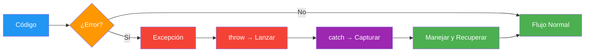
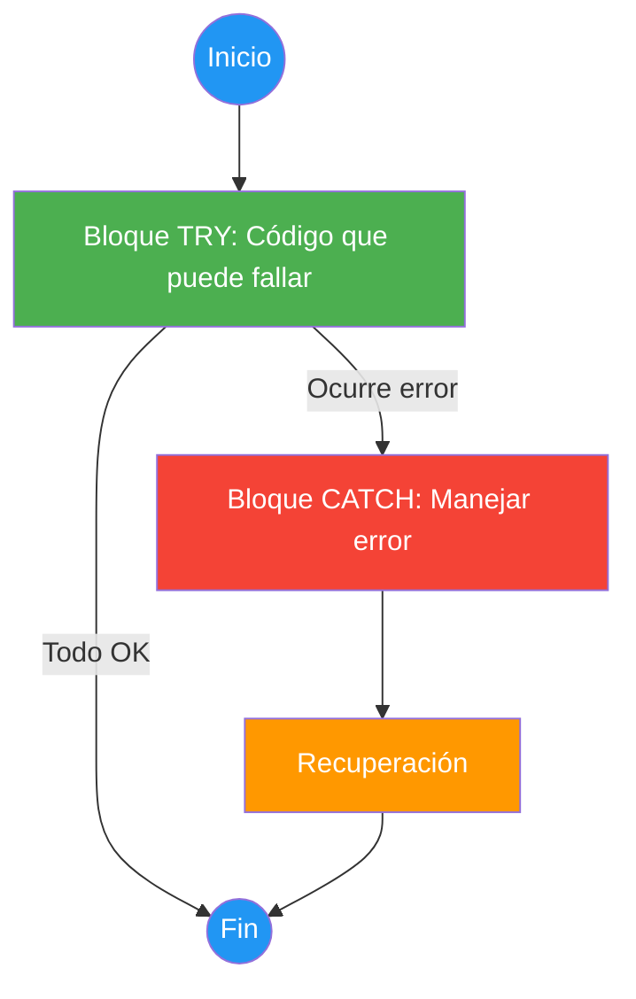
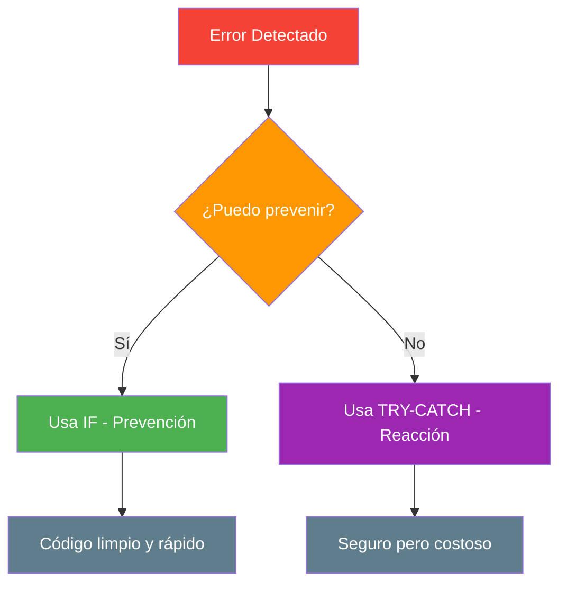
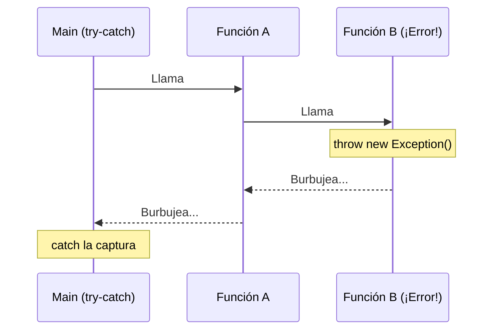
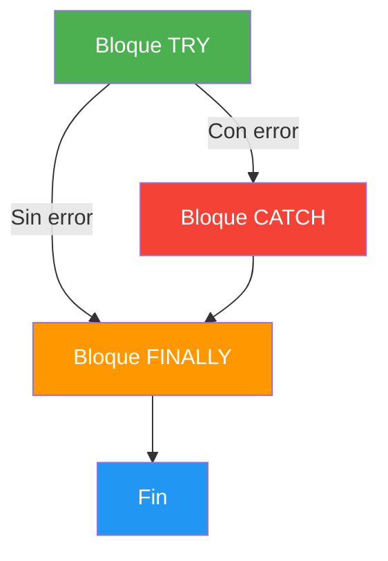
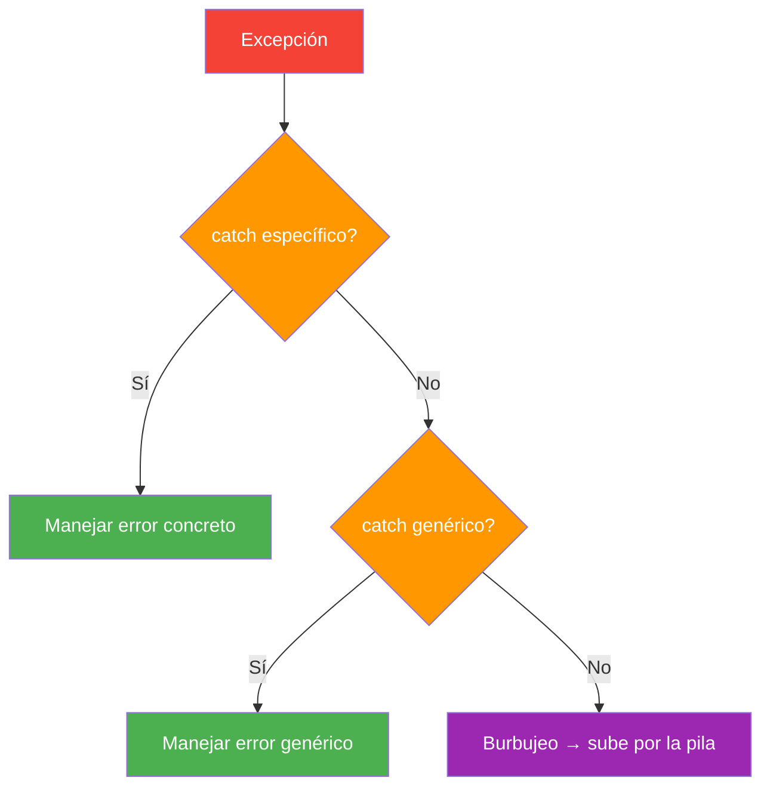
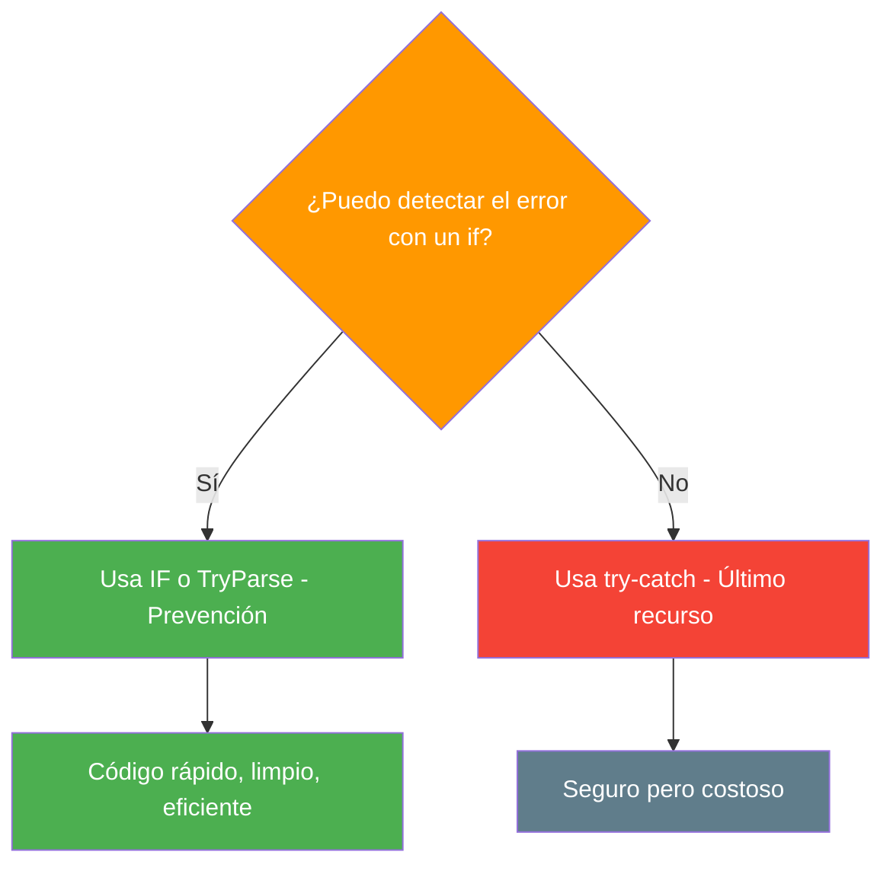
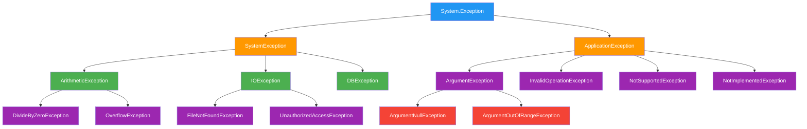

- [4. Control de Excepciones](#4-control-de-excepciones)
  - [4.1. ¿Qué es realmente una Excepción?](#41-qué-es-realmente-una-excepción)
  - [4.2. Lanzar una Excepción (`throw`)](#42-lanzar-una-excepción-throw)
  - [4.3. Capturar una Excepción (`try-catch`)](#43-capturar-una-excepción-try-catch)
  - [4.4. El significado profundo de manejar el error](#44-el-significado-profundo-de-manejar-el-error)
  - [4.5. El peligro de tratar las excepciones a la ligera](#45-el-peligro-de-tratar-las-excepciones-a-la-ligera)
  - [4.6. El Burbujeo de Excepciones](#46-el-burbujeo-de-excepciones)
  - [4.7. Bloques `try`, `catch` y `finally`](#47-bloques-try-catch-y-finally)
  - [4.8. Captura específica y filtros](#48-captura-específica-y-filtros)
  - [4.9. La Diferencia: Compilación vs. Ejecución](#49-la-diferencia-compilación-vs-ejecución)
  - [4.10. Buenas prácticas y ejemplo práctico](#410-buenas-prácticas-y-ejemplo-práctico)
  - [4.11. Principales Excepciones de .NET](#411-principales-excepciones-de-net)
  - [4.12. Checked vs Unchecked: ¿Por qué C# no obliga a capturar?](#412-checked-vs-unchecked-por-qué-c-no-obliga-a-capturar)
  - [4.13. Árbol de Excepciones de .NET](#413-árbol-de-excepciones-de-net)


# 4. Control de Excepciones

> 💡 **Punto de partida:** ¿Alguna vez has visto un avión con una bengala roja? Eso es una excepción: algo sale mal, el piloto lanza la bengala, y el control aéreo (el bloque `catch`) actúa en consecuencia. Sin la bengala, el avión seguiría volando con un problema oculto... hasta el desastre.

El **control de excepciones** es una técnica para manejar errores durante la ejecución de un programa. En lugar de que el programme se "cuelgue" o "rompa", las excepciones permiten **capturar y gestionar** los errores de forma controlada.



## 4.1. ¿Qué es realmente una Excepción?

Una **excepción** es un evento que interrumpe el flujo normal del programa. Es un "algo excepcional" que ocurre en tiempo de ejecución.

📌 **Ejemplo real:** Si Instagram intenta subir una foto y no hay conexión, lanza una excepción `HttpRequestException`. El bloque `catch` muestra "No hay conexión" en vez de que la app se cierre.

| Tipo de error | Ejemplo | ¿Se puede prever? |
|--------------|---------|-------------------|
| `FormatException` | `int.Parse("abc")` | Sí → usar `TryParse` |
| `DivideByZeroException` | `10 / 0` | Sí → usar `if` |
| `FileNotFoundException` | Abrir archivo que no existe | Parcialmente |
| `NullReferenceException` | Usar un `null` como si tuviera valor | Sí → verificar nulidad |

## 4.2. Lanzar una Excepción (`throw`)

`throw` es el acto de **notificar** que algo ha ido mal. Es como disparar la bengala.

```csharp
void RetirarDinero(decimal cantidad, decimal saldo)
{
    if (cantidad > saldo)
    {
        throw new InvalidOperationException("Saldo insuficiente.");
    }
    Console.WriteLine($"Retirado: {cantidad}€. Saldo restante: {saldo - cantidad}€");
}
```

📌 **Ejemplo real:** Si intentas comprar en Amazon y tu tarjeta no tiene fondos, el sistema lanza una excepción de negocio. No es un error técnico, es una regla de negocio que se ha violado.

> 💡 **Consejo:** Lanza excepciones cuando los datos o el estado del programa **no cumplan las reglas del negocio**, incluso si técnicamente la operación es posible.

## 4.3. Capturar una Excepción (`try-catch`)

Capturar es el acto de **recibir** la bengala y actuar para que el programa no muera.



```csharp
try
{
    Console.Write("Introduce un número: ");
    int numero = int.Parse(Console.ReadLine());
    Console.WriteLine($"Tu número: {numero}");
}
catch (FormatException)
{
    Console.WriteLine("Error: eso no es un número válido.");
}
```

## 4.4. El significado profundo de manejar el error

Manejar una excepción **NO es solo poner un mensaje**. Es devolver el programa a un **estado estable**.

- Si una transferencia bancaria falla a la mitad, el `catch` debe asegurar que el dinero vuelve a la cuenta de origen
- Si una subida de archivo falla, el `catch` debe limpiar los archivos parciales



## 4.5. El peligro de tratar las excepciones a la ligera

**1. Estado inconsistente (pérdida de datos)**

Si una excepción salta en mitad de un proceso de 5 pasos y el `catch` solo muestra un mensaje pero no deshace los 2 pasos anteriores, tus datos quedan **corruptos**.

**2. Catch vacíos ("Silencio de los Inocentes")**

```csharp
// ❌ NUNCA hagas esto
try
{
    ProcesoCritico();
}
catch (Exception e)
{
    // Catch vacío: el error desaparece silenciosamente
    // El programa sigue funcionando pero con errores internos ocultos
}
```

Es como tapar la luz de alarma de un avión con cinta adhesiva. El desastre acabará ocurriendo y será mucho más difícil encontrar el origen.

## 4.6. El Burbujeo de Excepciones

Si una función lanza una excepción y no tiene `catch`, esta **burbujea** hacia arriba en la pila de llamadas hasta encontrar uno.



```csharp
void MetodoA()
{
    MetodoB(); // Si MetodoB lanza, burbueba aquí
}

void MetodoB()
{
    throw new Exception("Error en B"); // Burbujea a MetodoA
}

try
{
    MetodoA(); // El catch de Main la captura
}
catch (Exception e)
{
    Console.WriteLine($"Capturado: {e.Message}");
}
```

## 4.7. Bloques `try`, `catch` y `finally`

- **`try`**: "Intenta" ejecutar esto
- **`catch`**: "Si falla", haz esto
- **`finally`**: "Hagas lo que hagas", ejecuta esto al final

```csharp
StreamReader? lector = null;
try
{
    lector = new StreamReader("datos.txt");
    string contenido = lector.ReadToEnd();
    Console.WriteLine(contenido);
}
catch (FileNotFoundException)
{
    Console.WriteLine("Archivo no encontrado.");
}
finally
{
    // Se ejecuta SIEMPRE, tanto si hay error como si no
    lector?.Close();
    Console.WriteLine("Recurso liberado.");
}
```



> 💡 **Consejo moderno:** En C#, usa `using` statements para manejar automáticamente la liberación de recursos. Es más limpio que `finally` manual:

```csharp
// Forma moderna y recomendada
using (StreamReader lector = new StreamReader("datos.txt"))
{
    string contenido = lector.ReadToEnd();
    Console.WriteLine(contenido);
} // El recurso se libera automáticamente aquí
```

## 4.8. Captura específica y filtros

### Orden de los `catch`: de específico a general

Los bloques `catch` se evalúan **de arriba a abajo**. El primero que coincida se ejecuta y el resto se ignoran. Por eso **siempre** debes poner el más específico primero y el genérico (`Exception`) al final.



```csharp
try
{
    int numero = int.Parse(Console.ReadLine());
}
// ✅ BUENO: específico primero
catch (FormatException e)          // 1º: formato mal → el más probable
{
    Console.WriteLine($"Formato incorrecto: {e.Message}");
}
catch (OverflowException e)        // 2º: desbordamiento → menos probable
{
    Console.WriteLine($"Número demasiado grande: {e.Message}");
}
catch (Exception e)                // 3º: TODO lo demás → comodín final
{
    Console.WriteLine($"Error inesperado: {e.Message}");
}
```

```csharp
// ❌ MALO: el genérico primero → los específicos NUNCA se ejecutan
catch (Exception e)                // ¡Esto captura TODO!
{
    Console.WriteLine($"Error: {e.Message}");
}
catch (FormatException e)          // ⚠️ Código muerto: nunca se alcanza
{
    Console.WriteLine($"Formato: {e.Message}");
}
```

> ⚠️ **Regla obligatoria:** Si pones `catch (Exception)` antes que un catch específico, el compilador avisa y los específicos quedan inalcanzables.

### Capturar varios tipos en un solo `catch`

Si quieres que un mismo `catch` maneje varios tipos de excepción, usa el operador `|` (OR):

```csharp
try
{
    int numero = int.Parse(Console.ReadLine());
}
catch (FormatException | OverflowException e)  // Captura ambos tipos
{
    Console.WriteLine($"Error de número: {e.Message}");
}
```

### Filtros de excepción (`when`)

Si necesitas más precisión (ej: distinguir según un valor), usa `when`:

```csharp
try
{
    ConectarABaseDeDatos();
}
catch (SqlException e) when (e.Number == 4060)   // Solo si la BD no existe
{
    Console.WriteLine("La base de datos no existe.");
}
catch (SqlException e) when (e.Number == 18456)  // Solo si es login incorrecto
{
    Console.WriteLine("Credenciales incorrectas.");
}
catch (SqlException e)                           // Cualquier otro error SQL
{
    Console.WriteLine($"Error de SQL: {e.Message}");
}
```

> 💡 **Consejo:** Piensa en los `catch` como especialistas médicos: un cardiólogo (catch específico) trata mejor un problema de corazón que un médico general (catch genérico).

## 4.9. La Diferencia: Compilación vs. Ejecución

| Fase | Nivel de Control | Ejemplos de Fallo |
|------|-----------------|-------------------|
| **Compilación** | Alto (programador) | Sintaxis, tipos incorrectos |
| **Ejecución** | Bajo (entorno) | Disco lleno, red cortada, entrada inválida |

Las excepciones ocurren en **tiempo de ejecución**. Los errores de compilación se detectan antes de ejecutar el programa.

## 4.10. Buenas prácticas y ejemplo práctico

### La regla de oro: SIEMPRE previene con `if`

Esto es **lo más importante** de toda la sección de excepciones. Repítelo como un mantra:

> ⚠️ **REGLA DE ORO:** Si puedes detectar un error con un `if` **antes** de que ocurra, **NUNCA** uses `try-catch`. Las excepciones son el **último recurso**, no la primera opción.

**¿Por qué?** Porque una excepción es **brutalmente costosa**:

| Aspecto | `if` (prevención) | `try-catch` (reacción) |
|---------|-------------------|------------------------|
| **Rendimiento** | Nanosegundos | Miles de veces más lento |
| **Memoria** | Cero bytes extra | Crea un objeto `Exception` con stack trace completo |
| **Código** | Limpio y directo | Verboso y anidado |
| **Filosofía** | "Evito el error" | "Espero a que explote y lo levanto" |

📌 **Analogía:** Usar `try-catch` cuando puedes usar `if` es como poner un ambulancia detrás de cada coche "por si choca". Funciona, pero es absurdo, caro e ineficiente. Mejor pon un semáforo (un `if`).

### Ejemplos: prevención vs excepción

#### 1. División por cero

```csharp
// ✅ BIEN: Prevención con if (nanosegundos)
int Dividir(int a, int b)
{
    if (b == 0)
    {
        Console.WriteLine("No se puede dividir por cero");
        return 0;
    }
    return a / b;
}

// ❌ MAL: Excepción (mil veces más lento)
int DividirMalo(int a, int b)
{
    try
    {
        return a / b;  // ¡BOOM! DivideByZeroException
    }
    catch (DivideByZeroException)
    {
        Console.WriteLine("No se puede dividir por cero");
        return 0;
    }
}
```

📌 **¿Cuándo usar `try-catch` para división por cero?** Solo si el divisor viene de una fuente que **no controlas** (una base de datos, un fichero, un usuario remoto) y no puedes verificarlo antes.

#### 2. Acceso a un array

```csharp
// ✅ BIEN: Prevención con if
int ObtenerElemento(int[] array, int indice)
{
    if (indice < 0 || indice >= array.Length)
    {
        Console.WriteLine("Índice fuera de rango");
        return -1;
    }
    return array[indice];
}

// ❌ MAL: Excepción
int ObtenerElementoMalo(int[] array, int indice)
{
    try
    {
        return array[indice];  // ¡BOOM! IndexOutOfRangeException
    }
    catch (IndexOutOfRangeException)
    {
        Console.WriteLine("Índice fuera de rango");
        return -1;
    }
}
```

#### 3. Convertir texto a número

```csharp
// ✅ BIEN: TryParse (prevención)
Console.Write("Edad: ");
string entrada = Console.ReadLine();

if (int.TryParse(entrada, out int edad))
{
    Console.WriteLine($"Tienes {edad} años");
}
else
{
    Console.WriteLine("No es un número válido");
}

// ❌ MAL: Parse con try-catch (excepción)
try
{
    int edad = int.Parse(entrada);  // ¡BOOM! FormatException si no es número
    Console.WriteLine($"Tienes {edad} años");
}
catch (FormatException)
{
    Console.WriteLine("No es un número válido");
}
```

#### 4. Abrir un fichero

```csharp
// ✅ BIEN: Verificar si existe antes
string ruta = "datos.txt";
if (File.Exists(ruta))
{
    string contenido = File.ReadAllText(ruta);
    Console.WriteLine(contenido);
}
else
{
    Console.WriteLine("El fichero no existe");
}

// ❌ MAL: Excepción directa
try
{
    string contenido = File.ReadAllText("datos.txt");  // ¡BOOM! FileNotFoundException
    Console.WriteLine(contenido);
}
catch (FileNotFoundException)
{
    Console.WriteLine("El fichero no existe");
}
```

#### 5. Leer un entero con rango (el caso clásico)

```csharp
// ✅ BIEN: TryParse + validación de rango
int LeerEntero(string mensaje, int min, int max)
{
    int valor;
    bool esValido;

    do
    {
        Console.Write($"{mensaje} ({min}-{max}): ");
        esValido = int.TryParse(Console.ReadLine(), out valor);

        if (!esValido)
            Console.WriteLine("❌ No es un número válido.");
        else if (valor < min || valor > max)
        {
            Console.WriteLine($"❌ El valor debe estar entre {min} y {max}.");
            esValido = false;
        }

    } while (!esValido);

    return valor;
}

// ❌ MAL: Parse con try-catch
int LeerEnteroMalo(string mensaje, int min, int max)
{
    int valor = 0;
    bool esValido;

    do
    {
        try
        {
            Console.Write($"{mensaje} ({min}-{max}): ");
            valor = int.Parse(Console.ReadLine());

            if (valor < min || valor > max)
                Console.WriteLine($"❌ Fuera de rango.");
            else
                esValido = true;
        }
        catch (FormatException)
        {
            Console.WriteLine("❌ No es un número.");
            esValido = false;
        }
        catch (OverflowException)
        {
            Console.WriteLine("❌ Número demasiado grande.");
            esValido = false;
        }

    } while (!esValido);

    return valor;
}
```

📌 **¿Por qué `TryParse` es mejor?** Porque cuando el valor válido es `0`, `TryParse` devuelve `true` y `valor = 0`. No hay ambigüedad: el `bool` te dice si la conversión fue correcta, y el `out` te da el valor. Con `Parse`, si el usuario escribe `0`, la excepción no se lanza... pero si escribe `"abc"`, sí. No puedes distinguir "0 válido" de "error" sin try-catch.

### Resumen: ¿Cuándo usar cada uno?



| Situación | ¿Qué usar? | Por qué |
|-----------|------------|---------|
| División por cero | `if (b == 0)` | Es predecible |
| Índice fuera de rango | `if (indice < 0 \|\| indice >= array.Length)` | Es predecible |
| Texto a número | `int.TryParse(...)` | Es predecible |
| Fichero no existe | `if (File.Exists(...))` | Es predecible |
| Conexión a BD falla | `try-catch` | No lo controlas |
| Disco lleno | `try-catch` | No lo controlas |
| Usuario escribe basura | `TryParse` | Es predecible |

> ⚠️ **La excepción es para errores INESPERADOS**, no para errores que puedes ver venir. Si puedes ver venir el error, previene con `if`.

> 💡 **Regla nemotécnica:** "Si el `if` puede verlo, el `try-catch` no lo toca."

## 4.11. Principales Excepciones de .NET

.NET trae decenas de excepciones listas para usar. No necesitas crear las tuyas (eso lo verás con herencia en la UD04). Por ahora, aprende a **lanzar y capturar** las que ya existen.

📌 **Ejemplo real:** Netflix lanza `ArgumentException` cuando le pasas un ID de usuario nulo, `FormatException` cuando el email no tiene formato válido, y `InvalidOperationException` cuando intentas acceder a contenido que aún no está disponible.

### Excepciones más usadas

| Excepción | Cuándo lanzarla | Ejemplo |
|-----------|----------------|---------|
| `ArgumentException` | Argumento no válido en general | `email` no contiene `@` |
| `ArgumentNullException` | Argumento es `null` y no debería serlo | `nombre` es `null` |
| `ArgumentOutOfRangeException` | Argumento fuera de un rango válido | `edad` es -5 o 200 |
| `FormatException` | Formato incorrecto | `"abc"` no es un `int` |
| `InvalidOperationException` | Operación no válida en el estado actual | Conectar sin haber desconectado |
| `DivideByZeroException` | División entre cero | `10 / 0` |
| `OverflowException` | Número demasiado grande para el tipo | `int.Parse("99999999999")` |
| `NotSupportedException` | Operación no soportada | Método que aún no está implementado |
| `NotImplementedException` | Código pendiente de implementar | Stub temporal |

### Lanzar excepciones existentes

```csharp
void Registrar(string nombre, string email, int edad)
{
    if (string.IsNullOrEmpty(nombre))
        throw new ArgumentNullException(nameof(nombre), "El nombre no puede ser nulo");
    if (nombre.Length < 2)
        throw new ArgumentException("El nombre debe tener al menos 2 caracteres", nameof(nombre));
    if (!email.Contains("@"))
        throw new FormatException("El email no es válido");
    if (edad < 0 || edad > 150)
        throw new ArgumentOutOfRangeException(nameof(edad), "La edad debe estar entre 0 y 150");

    Console.WriteLine($"Registrado: {nombre}, {email}, {edad} años");
}
```

> 💡 **Consejo:** Usa `nameof(variable)` en los mensajes de error. Si renombras la variable, el mensaje se actualiza automáticamente.

## 4.12. Checked vs Unchecked: ¿Por qué C# no obliga a capturar?

En programación hay dos tipos de excepciones según el lenguaje:

| Tipo | Significado | Ejemplo en Java | ¿Existe en C#? |
|------|-------------|-----------------|-----------------|
| **Checked** | El compilador **obliga** a capturar o declarar (`throws`) | `IOException`, `SQLException` | ❌ No |
| **Unchecked** | El compilador **no obliga** a capturar | `NullPointerException`, `IndexOutOfBoundsException` | ✅ Todas |

📌 **Ejemplo real:** En Java, si abres un fichero, el compilador te **obliga** a escribir un `try-catch` o un `throws FileNotFoundException`. En C#, confía en ti: si no capturas la excepción, simplemente burbujea hasta el programa principal y lo cierra.

### Java vs C#

```java
// JAVA: checked exception → OBLIGA a try-catch o throws
public void LeerFichero() throws FileNotFoundException {  // ← declarar
    FileInputStream fis = new FileInputStream("datos.txt"); // ← puede fallar
}

// Sin try-catch NI throws → ¡ERROR DE COMPILACIÓN en Java!
```

```csharp
// C#: unchecked exception → NO obliga a nada
void LeerFichero()
{
    StreamReader sr = new StreamReader("datos.txt"); // ← puede fallar
    // No hay error de compilación. Si el fichero no existe → excepción en runtime
}
```

### ¿Por qué C# eligió solo unchecked?

1. **Simplicidad**: No tienes que decorar cada método con `throws` para cada excepción que pueda lanzar
2. **Flexibilidad**: El programador decide cuándo y dónde capturar, no el compilador
3. **Refactoring seguro**: Si cambias una excepción, no rompes toda la cadena de `throws`
4. **Confianza en el programador**: C# confía en que sabrás cuándo capturar

> 💡 **Analogía:** Java es como un colegio con uniforme obligatorio (checked). C# es como un coworking casual (unchecked): tú decides cómo vestirte, pero si vas en pijama y te echan, es tu problema.

### ¿Cómo sé debo capturar algo?

Si **puedes hacer algo útil** con el error (mostrar mensaje, reintentar, log) → **captura**.
Si **no puedes hacer nada** (el programa no puede seguir) → **no captures** y deja que burbujee.

```csharp
// ✅ BUENO: capturo porque puedo mostrar un mensaje útil
try
{
    int edad = int.Parse(Console.ReadLine());
}
catch (FormatException)
{
    Console.WriteLine("Por favor, introduce un número válido");
}

// ✅ TAMBIÉN BIEN: no capturo porque no puedo hacer nada
// Si falla la conexión a la BD, el programa no puede continuar
void ConectarABaseDeDatos()
{
    using var conexion = new SqlConnection(cadenaConexion);
    conexion.Open();  // Si falla → que burbujee al nivel superior
}
```

## 4.13. Árbol de Excepciones de .NET

Todas las excepciones en .NET heredan de `System.Exception`. Este es el árbol简化ado con las que trabajarás:



### Las dos ramas principales

| Rama | Padre | Qué incluye |
|------|-------|-------------|
| **`SystemException`** | Errores del **sistema** | División por cero, E/S, desbordamiento numérico |
| **`ApplicationException`** | Errores de la **aplicación** | Argumentos inválidos, operación no válida |

> 📝 **Nota:** En la práctica, la distinción entre `SystemException` y `ApplicationException` no es muy relevante. Lo importante es que **todas** heredan de `Exception`, por lo que puedes capturar `Exception` como comodín final.

### Regla de captura según la jerarquía

Como `ArgumentNullException` **es un tipo de** `ArgumentException`, que **es un tipo de** `Exception`:

```csharp
// Estos tres catch son equivalentes para ArgumentNullException:
catch (ArgumentNullException ex)     // Captura SOLO ArgumentNullException
catch (ArgumentException ex)          // Captura ArgumentException Y sus hijas (ArgumentNullException, ArgumentOutOfRangeException)
catch (Exception ex)                  // Captura TODO
```

> 💡 **Consejo:** Captura el tipo **más específico** posible. Si capturas `Exception`, estás tapando errores que podrías manejar mejor con un catch concreto.

En el siguiente punto haremos un resumen de toda la unidad, consolidando todos los conceptos vistos: programación estructurada, modular y control de excepciones.
