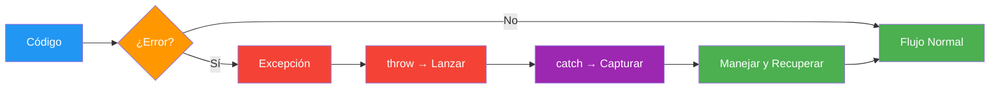
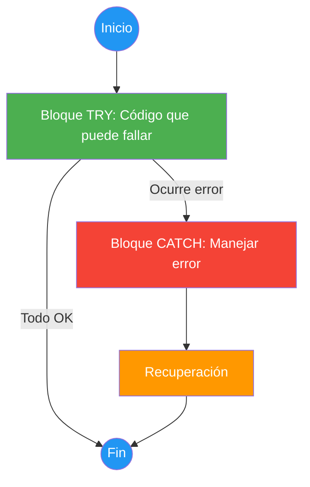
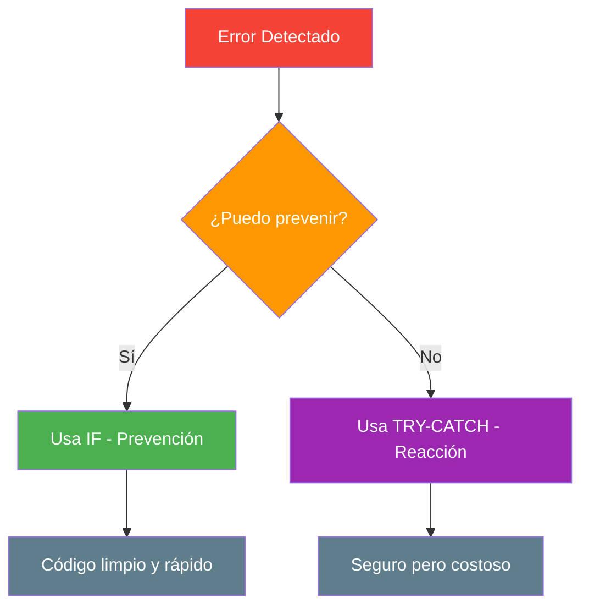
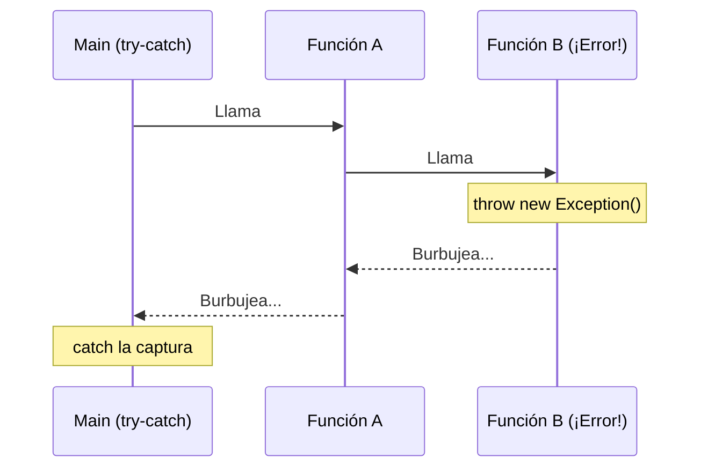
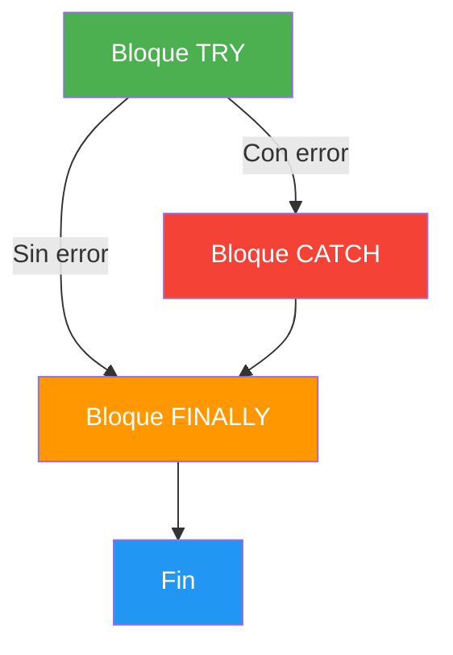

- [4. Control de Excepciones](#4-control-de-excepciones)
  - [4.1. ¿Qué es realmente una Excepción?](#41-qué-es-realmente-una-excepción)
  - [4.2. Lanzar una Excepción (`throw`)](#42-lanzar-una-excepción-throw)
  - [4.3. Capturar una Excepción (`try-catch`)](#43-capturar-una-excepción-try-catch)
  - [4.4. El significado profundo de manejar el error](#44-el-significado-profundo-de-manejar-el-error)
  - [4.5. Prevención vs. Reacción: `if` vs `try-catch`](#45-prevención-vs-reacción-if-vs-try-catch)
  - [4.6. El peligro de tratar las excepciones a la ligera](#46-el-peligro-de-tratar-las-excepciones-a-la-ligera)
  - [4.7. El Burbujeo de Excepciones](#47-el-burbujeo-de-excepciones)
  - [4.8. Bloques `try`, `catch` y `finally`](#48-bloques-try-catch-y-finally)
  - [4.9. Captura específica y filtros](#49-captura-específica-y-filtros)
  - [4.10. La Diferencia: Compilación vs. Ejecución](#410-la-diferencia-compilación-vs-ejecución)
  - [4.11. Buenas prácticas](#411-buenas-prácticas)


# 4. Control de Excepciones

> 💡 **Punto de partida:** ¿Alguna vez has visto un avión con una bengala roja? Eso es una excepción: algo sale mal, el piloto lanza la bengala, y el control aéreo (el bloque `catch`) actúa en consecuencia. Sin la bengala, el avión seguiría volando con un problema oculto... hasta el desastre.

El **control de excepciones** es una técnica para manejar errores durante la ejecución de un programa. En lugar de que el programme se "cuelgue" o "rompa", las excepciones permiten **capturar y gestionar** los errores de forma controlada.



## 4.1. ¿Qué es realmente una Excepción?

Una **excepción** es un evento que interrumpe el flujo normal del programa. Es un "algo excepcional" que ocurre en tiempo de ejecución.

📌 **Ejemplo real:** Si Instagram intenta subir una foto y no hay conexión, lanza una excepción `HttpRequestException`. El bloque `catch` muestra "No hay conexión" en vez de que la app se cierre.

| Tipo de error | Ejemplo | ¿Se puede prever? |
|--------------|---------|-------------------|
| `FormatException` | `int.Parse("abc")` | Sí → usar `TryParse` |
| `DivideByZeroException` | `10 / 0` | Sí → usar `if` |
| `FileNotFoundException` | Abrir archivo que no existe | Parcialmente |
| `NullReferenceException` | Usar un `null` como si tuviera valor | Sí → verificar nulidad |

## 4.2. Lanzar una Excepción (`throw`)

`throw` es el acto de **notificar** que algo ha ido mal. Es como disparar la bengala.

```csharp
void RetirarDinero(decimal cantidad, decimal saldo)
{
    if (cantidad > saldo)
    {
        throw new InvalidOperationException("Saldo insuficiente.");
    }
    Console.WriteLine($"Retirado: {cantidad}€. Saldo restante: {saldo - cantidad}€");
}
```

📌 **Ejemplo real:** Si intentas comprar en Amazon y tu tarjeta no tiene fondos, el sistema lanza una excepción de negocio. No es un error técnico, es una regla de negocio que se ha violado.

> 💡 **Consejo:** Lanza excepciones cuando los datos o el estado del programa **no cumplan las reglas del negocio**, incluso si técnicamente la operación es posible.

## 4.3. Capturar una Excepción (`try-catch`)

Capturar es el acto de **recibir** la bengala y actuar para que el programa no muera.



```csharp
try
{
    Console.Write("Introduce un número: ");
    int numero = int.Parse(Console.ReadLine());
    Console.WriteLine($"Tu número: {numero}");
}
catch (FormatException)
{
    Console.WriteLine("Error: eso no es un número válido.");
}
```

## 4.4. El significado profundo de manejar el error

Manejar una excepción **NO es solo poner un mensaje**. Es devolver el programa a un **estado estable**.

- Si una transferencia bancaria falla a la mitad, el `catch` debe asegurar que el dinero vuelve a la cuenta de origen
- Si una subida de archivo falla, el `catch` debe limpiar los archivos parciales



## 4.5. Prevención vs. Reacción: `if` vs `try-catch`

Para entender por qué no debemos abusar de las excepciones:

**Opción A: Prevención con `if` (recomendada cuando es posible)**

```csharp
int numerador = 10;
int divisor = 0;

if (divisor != 0)
{
    Console.WriteLine($"Resultado: {numerador / divisor}");
}
else
{
    Console.WriteLine("Error: No se puede dividir por cero.");
}
```

- **Rendimiento**: nanosegundos (una comparación simple)
- **Legibilidad**: claro e intuitivo
- **Uso**: cuando el error es predecible

**Opción B: Reacción con `try-catch` (cuando no se puede prever)**

```csharp
int numerador = 10;
int divisor = 0;

try
{
    Console.WriteLine($"Resultado: {numerador / divisor}");
}
catch (DivideByZeroException)
{
    Console.WriteLine("Error: División por cero.");
}
```

- **Rendimiento**: miles de veces más lento (crea objeto Exception, guarda pila de llamadas)
- **Legibilidad**: un poco más verboso
- **Uso**: cuando el error depende de factores externos (archivo, red, usuario)

> 💡 **Regla de oro:** Si puedes prever el error con un `if`, usa `if`. Usa `try-catch` solo cuando el error no sea controlable por el programador.

## 4.6. El peligro de tratar las excepciones a la ligera

**1. Estado inconsistente (pérdida de datos)**

Si una excepción salta en mitad de un proceso de 5 pasos y el `catch` solo muestra un mensaje pero no deshace los 2 pasos anteriores, tus datos quedan **corruptos**.

**2. Catch vacíos ("Silencio de los Inocentes")**

```csharp
// ❌ NUNCA hagas esto
try
{
    ProcesoCritico();
}
catch (Exception e)
{
    // Catch vacío: el error desaparece silenciosamente
    // El programa sigue funcionando pero con errores internos ocultos
}
```

Es como tapar la luz de alarma de un avión con cinta adhesiva. El desastre acabará ocurriendo y será mucho más difícil encontrar el origen.

## 4.7. El Burbujeo de Excepciones

Si una función lanza una excepción y no tiene `catch`, esta **burbujea** hacia arriba en la pila de llamadas hasta encontrar uno.



```csharp
void MetodoA()
{
    MetodoB(); // Si MetodoB lanza, burbueba aquí
}

void MetodoB()
{
    throw new Exception("Error en B"); // Burbujea a MetodoA
}

try
{
    MetodoA(); // El catch de Main la captura
}
catch (Exception e)
{
    Console.WriteLine($"Capturado: {e.Message}");
}
```

## 4.8. Bloques `try`, `catch` y `finally`

- **`try`**: "Intenta" ejecutar esto
- **`catch`**: "Si falla", haz esto
- **`finally`**: "Hagas lo que hagas", ejecuta esto al final

```csharp
StreamReader? lector = null;
try
{
    lector = new StreamReader("datos.txt");
    string contenido = lector.ReadToEnd();
    Console.WriteLine(contenido);
}
catch (FileNotFoundException)
{
    Console.WriteLine("Archivo no encontrado.");
}
finally
{
    // Se ejecuta SIEMPRE, tanto si hay error como si no
    lector?.Close();
    Console.WriteLine("Recurso liberado.");
}
```



> 💡 **Consejo moderno:** En C#, usa `using` statements para manejar automáticamente la liberación de recursos. Es más limpio que `finally` manual:

```csharp
// Forma moderna y recomendada
using (StreamReader lector = new StreamReader("datos.txt"))
{
    string contenido = lector.ReadToEnd();
    Console.WriteLine(contenido);
} // El recurso se libera automáticamente aquí
```

## 4.9. Captura específica y filtros

**Captura específica**: No captures `Exception` genérica si puedes capturar un tipo concreto.

```csharp
try
{
    int numero = int.Parse(Console.ReadLine());
}
catch (FormatException e)
{
    Console.WriteLine($"Formato incorrecto: {e.Message}");
}
catch (OverflowException e)
{
    Console.WriteLine($"Número demasiado grande: {e.Message}");
}
catch (Exception e)
{
    Console.WriteLine($"Error inesperado: {e.Message}");
}
```

**Filtros de excepción** (`when`):

```csharp
try
{
    ConectarABaseDeDatos();
}
catch (SqlException e) when (e.Number == 4060)
{
    Console.WriteLine("La base de datos no existe.");
}
catch (SqlException e)
{
    Console.WriteLine($"Error de SQL: {e.Message}");
}
```

> 💡 **Consejo:** Piensa en las excepciones como especialistas médicos: un cardiólogo (catch específico) trata mejor un problema de corazón que un médico general (catch genérico).

## 4.10. La Diferencia: Compilación vs. Ejecución

| Fase | Nivel de Control | Ejemplos de Fallo |
|------|-----------------|-------------------|
| **Compilación** | Alto (programador) | Sintaxis, tipos incorrectos |
| **Ejecución** | Bajo (entorno) | Disco lleno, red cortada, entrada inválida |

Las excepciones ocurren en **tiempo de ejecución**. Los errores de compilación se detectan antes de ejecutar el programa.

## 4.11. Buenas prácticas

1. **Captura específica**: Usa el tipo de excepción más concreto posible
2. **No ignores errores**: Un `catch` vacío es peligroso; oculta problemas
3. **Informa bien**: Da mensajes que ayuden al usuario a corregir
4. **Limpia recursos**: Usa `finally` o `using` para liberar recursos
5. **Usa `if` cuando puedas prever**: Prevención > reacción
6. **Documenta**: Comenta por qué lanzas o capturas excepciones

> ⚠️ **Regla de oro:** Las excepciones son para situaciones **excepcionales**, no para controlar el flujo normal del programa. Si puedes usar `if`, úsalo.

En el siguiente punto haremos un resumen de toda la unidad, consolidando todos los conceptos vistos: programación estructurada, modular y control de excepciones.
