- [5. Resumen y Conclusiones UD02](#5-resumen-y-conclusiones-ud02)
  - [5.1. Mapa Conceptual de la Unidad](#51-mapa-conceptual-de-la-unidad)
  - [5.2. Conceptos Clave](#52-conceptos-clave)
    - [Programación Estructurada](#programación-estructurada)
    - [Programación Modular](#programación-modular)
    - [Control de Excepciones](#control-de-excepciones)
    - [Documentación y Comentarios](#documentación-y-comentarios)
  - [5.3. Herramientas y Perfiles](#53-herramientas-y-perfiles)
    - [IDE](#ide)
    - [Comandos CLI](#comandos-cli)
    - [Depuración](#depuración)
  - [5.4. Errores Comunes a Evitar](#54-errores-comunes-a-evitar)
  - [5.5. Checklist de Supervivencia](#55-checklist-de-supervivencia)
  - [5.6. Glosario de Términos](#56-glosario-de-términos)
  - [5.7. Ejercicios de Repaso](#57-ejercicios-de-repaso)
  - [5.8. ¿Qué viene después?](#58-qué-viene-después)
  - [5.9. Mapa de Conexiones entre Temas](#59-mapa-de-conexiones-entre-temas)


# 5. Resumen y Conclusiones UD02

> 💡 **Punto de partida:** Has pasado de escribir código lineal a construir programas que piensan (condicionales), repiten (bucles), se organizan (módulos) y se recuperan de errores (excepciones). Eso es ser programador/a.

**Objetivos de aprendizaje:**
- Repasar los conceptos fundamentales de la unidad
- Consolidar el vocabulario técnico
- Tener una referencia rápida para el examen

## 5.1. Mapa Conceptual de la Unidad

```mermaid
graph TD
    UD02[UD02: Estructurada y Modular] --> ES[Estructurada]
    UD02 --> MO[Modular]
    UD02 --> EX[Excepciones]
    ES --> SEC[Secuencia: paso a paso]
    ES --> CON[Condicional: if, switch]
    ES --> BUC[Bucle: while, for, do-while]
    ES --> SALTO[Salto: break, continue]
    MO --> FUN[Funciones: return valor]
    MO --> PROC[Procedimientos: void]
    MO --> PARAM[Parámetros: ref, out, in, params]
    MO --> SCOPE[Ámbito: global vs local]
    MO --> REC[Recursividad]
    MO --> EARLY[Early Return]
    EX --> TRY[try-catch-finally]
    EX --> THROW[throw: lanzar]
    EX --> ASSERT[Aserciones: Debug.Assert]
    EX --> EXNET[Excepciones .NET: ArgumentException, FormatException...]
    EX --> ORDER[Orden: específico → general]
    EX --> UNCHECKED[Unchecked: C# no obliga a capturar]
    ES --> DOC[Documentación: XMLDoc]
    style UD02 fill:#2196F3,color:#fff
    style ES fill:#4CAF50,color:#fff
    style MO fill:#FF9800,color:#fff
    style EX fill:#9C27B0,color:#fff
    style SEC fill:#607D8B,color:#fff
    style CON fill:#607D8B,color:#fff
    style BUC fill:#607D8B,color:#fff
    style SALTO fill:#607D8B,color:#fff
    style FUN fill:#607D8B,color:#fff
    style PROC fill:#607D8B,color:#fff
    style PARAM fill:#607D8B,color:#fff
    style SCOPE fill:#607D8B,color:#fff
    style REC fill:#607D8B,color:#fff
    style EARLY fill:#607D8B,color:#fff
    style TRY fill:#607D8B,color:#fff
    style THROW fill:#607D8B,color:#fff
    style ASSERT fill:#607D8B,color:#fff
    style EXNET fill:#607D8B,color:#fff
    style ORDER fill:#607D8B,color:#fff
    style UNCHECKED fill:#607D8B,color:#fff
    style DOC fill:#607D8B,color:#fff
```



## 5.2. Conceptos Clave

### Programación Estructurada

- **Teorema**: cualquier algoritmo se escribe con secuencia, condicional y bucle
- **DRY**: no repitas código; si lo haces, necesitas un módulo o un bucle
- **`if-else`**: toma decisiones; evalúa de arriba a abajo
- **`switch`**: compara una variable contra múltiples valores concretos
- **`while`**: repite mientras se cumpla la condición (puede no ejecutarse)
- **`do-while`**: como `while` pero garantiza al menos una ejecución
- **`for`**: repite un número conocido de veces (inicialización, condición, incremento)
- **`foreach`**: recorre colecciones automáticamente
- **`break`**: sale del bucle actual
- **`continue`**: salta a la siguiente iteración
- **Bucle infinito**: error cuando la condición de salida nunca se cumple

📌 **Ejemplo real:** Netflix usa `while` para seguir reproduciendo episodios, `if` para decidir si eres premium, y `for` para recorrer tu lista de favoritos.

### Programación Modular

- **DAC (Divide y Vencerás)**: divide problemas grandes en subproblemas
- **SRP**: cada módulo, una responsabilidad
- **Función**: devuelve un valor (`return`)
- **Procedimiento**: no devuelve nada (`void`)
- **Paso por valor**: copia del dato (por defecto, seguro)
- **`ref`**: paso por referencia (modifica el original)
- **`out`**: salida múltiple (debe asignar antes de terminar)
- **`in`**: solo lectura por referencia (eficiente para structs)
- **`params`**: lista variable de argumentos
- **Ámbito global**: accesible en todo (evitar)
- **Ámbito local**: solo dentro del método (recomendado)
- **Sobrecarga**: mismo nombre, diferentes parámetros
- **Early Return**: simplifica condicionales (Guard Clauses)
- **Recursividad**: método que se llama a sí mismo (requiere caso base)

📌 **Ejemplo real:** Spotify tiene una función `CalcularDuracion()` que reutiliza en todas las playlists. Si cambia la lógica, solo toca un sitio.

### Control de Excepciones

- **Excepción**: error en tiempo de ejecución
- **`throw`**: lanza una excepción (notifica el error)
- **`try`**: rodea el código que puede fallar
- **`catch`**: maneja el error cuando ocurre
- **`finally`**: se ejecuta siempre (liberar recursos)
- **Burbujeo**: si no hay `catch`, la excepción sube por la pila
- **Preferir `if`**: si el error es predecible, previene en vez de reaccionar
- **Unchecked**: en C# todas las excepciones son unchecked (no obliga a capturar)
- **De específico a general**: orden de los `catch` (el genérico va al final)
- **`|` en catch**: capturar varios tipos en un solo bloque
- **`when`**: filtro para distinguir según un valor
- **`ArgumentException`**: argumento no válido
- **`ArgumentNullException`**: argumento es `null`
- **`ArgumentOutOfRangeException`**: argumento fuera de rango
- **`FormatException`**: formato incorrecto de datos

📌 **Ejemplo real:** Amazon lanza una `ArgumentException` cuando el carrito está vacío y el usuario intenta pagar. El `catch` muestra un mensaje amigable en vez de que la app se cierre.

### Documentación y Comentarios

- **Comentarios `//`**: para explicar lógica compleja o decisiones de negocio
- **XMLDoc `/// <summary>`**: documentación automática de clases y métodos públicos
- **`/// <param>`**: describe cada parámetro
- **`/// <returns>`**: describe qué devuelve la función
- **`/// <inheritdoc />`**: en implementaciones de interfaces

📌 **Ejemplo real:** Netflix documenta su API interna con XMLDoc para que cualquier desarrollador nuevo entienda qué hace cada función sin leer el código completo.

```csharp
/// <summary>
/// Calcula el descuento aplicable a una compra.
/// </summary>
/// <param name="total">Importe total de la compra en euros.</param>
/// <param name="esPremium">Si el cliente es premium.</param>
/// <returns>El descuento aplicado en euros.</returns>
double CalcularDescuento(double total, bool esPremium)
{
    // Si es premium, 10% de descuento; si no, 5%
    return esPremium ? total * 0.10 : total * 0.05;
}
```

| Tipo de comentario | Cuándo usarlo |
|-------------------|---------------|
| `// Explicación` | Lógica compleja, decisiones "por qué" |
| `/// <summary>` | Métodos públicos, clases, interfaces |
| `// TODO:` | Pendientes que hay que resolver |
| `// HACK:` | Solución temporal que hay que mejorar |

> ⚠️ **Advertencia:** No comentes código autoexplicativo (`// suma dos números` en `suma = a + b`). Comenta el **por qué**, no el **qué**.

## 5.3. Herramientas y Perfiles

### IDE
- **JetBrains Rider**: depurador visual, puntos de interrupción, inspección de variables
- **Visual Studio Code**: con extensión C#, depurador integrado

### Comandos CLI
- **`dotnet run`**: compila y ejecuta el proyecto
- **`dotnet build`**: solo compila (para verificar errores)
- **`dotnet new console`**: crea un nuevo proyecto de consola

### Depuración
- **Breakpoints**: pausan la ejecución en una línea
- **Step Over**: ejecuta una línea sin entrar en funciones
- **Step Into**: entra dentro de funciones para ver su lógica
- **Watch**: monitoriza variables en tiempo real

## 5.4. Errores Comunes a Evitar

| Error | Por qué está mal | Cómo evitarlo |
|-------|------------------|---------------|
| Bucle infinito | El programa nunca termina | Verificar que la variable de control cambia |
| `catch` vacío | Oculta errores silenciosamente | Siempre hacer algo en el `catch` (al menos un `Console.WriteLine`) |
| Olvidar `ref` en llamada | Error de compilación | Escribir `ref` tanto en definición como en llamada |
| `out` sin asignar | Error de compilación | Asignar TODOS los caminos posibles dentro del método |
| Usar `try-catch` para todo | Rendimiento degradado | Preferir `if` cuando el error es predecible |
| Variables globales | Efectos secundarios difíciles de rastrear | Usar parámetros para pasar datos |
| `switch` sin `break` | Error de compilación en C# | Siempre terminar cada `case` con `break` |

## 5.5. Checklist de Supervivencia

Antes de dar por cerrado el tema, asegúrate de poder responder **SÍ** a estas preguntas:

- [ ] ¿Puedo escribir un `if-else if-else` y un `switch` para resolver un problema?
- [ ] ¿Sé cuándo usar `while`, `for` y `do-while`?
- [ ] ¿Puedo crear una función que devuelva un valor y un procedimiento que no devuelva nada?
- [ ] ¿Entiendo la diferencia entre `ref`, `out` e `in`?
- [ ] ¿Soy capaz de usar `params` para aceptar argumentos variables?
- [ ] ¿Comprendo el ámbito de las variables (local vs. global)?
- [ ] ¿Puedo usar `try-catch-finally` para manejar errores?
- [ ] ¿Sé por qué el `if` es mejor que `try-catch` cuando puedo prever el error?
- [ ] ¿Entiendo qué es la recursividad y por qué necesita un caso base?
- [ ] ¿Puedo usar `Early Return` para simplificar mi código?
- [ ] ¿Sé documentar un método con XMLDoc (`/// <summary>`, `/// <param>`, `/// <returns>`)?
- [ ] ¿Puedo lanzar `ArgumentException`, `ArgumentNullException` y `FormatException` con mensajes descriptivos?
- [ ] ¿Entiendo por qué en C# todas las excepciones son unchecked y no obliga a capturar?
- [ ] ¿Sé ordenar los `catch` de específico a general?
- [ ] ¿Sé usar `Debug.Assert` para verificar supuestos durante la depuración?

> 🔧 **Truco:** Crea un programa que pida dos números y los sume dentro de una función. Luego añade un `try-catch` para manejar si el usuario no introduce números. Si funciona, dominas lo básico de esta unidad.

## 5.6. Glosario de Términos

| Término | Definición |
|---------|------------|
| **Programación estructurada** | Paradigma basado en secuencia, condicional y bucle |
| **Programación modular** | Paradigma que divide el programa en módulos independientes |
| **Secuencia** | Ejecución de instrucciones una tras otra |
| **Condicional** | Estructura que toma decisiones según una condición |
| **Bucle** | Estructura que repite código mientras se cumpla una condición |
| **DRY** | Don't Repeat Yourself: no repitas código |
| **SRP** | Single Responsibility Principle: un módulo, una responsabilidad |
| **DAC** | Divide and Conquer: divide y vencerás |
| **Función** | Método que devuelve un valor mediante `return` |
| **Procedimiento** | Método que no devuelve nada (`void`) |
| **Parámetro** | Variable de la definición del método |
| **Argumento** | Valor real que se pasa al llamar al método |
| **`ref`** | Modificador de paso por referencia |
| **`out`** | Modificador de salida múltiple |
| **`in`** | Modificador de solo lectura por referencia |
| **`params`** | Modificador para listas variables de argumentos |
| **Ámbito** | Zona del programa donde una variable es accesible |
| **Sobrecarga** | Múltiples métodos con el mismo nombre pero diferentes parámetros |
| **Early Return** | Técnica para salir anticipadamente de un método |
| **Guard Clauses** | Condiciones de error al inicio de un método |
| **Recursividad** | Método que se llama a sí mismo |
| **Caso base** | Condición de parada en la recursividad |
| **Stack Overflow** | Error por desbordamiento de pila de llamadas |
| **Excepción** | Error en tiempo de ejecución |
| **`throw`** | Sentencia que lanza una excepción |
| **`try-catch`** | Estructura para capturar y manejar excepciones |
| **`finally`** | Bloque que se ejecuta siempre, con o sin error |
| **Burbujeo** | Propagación de excepciones por la pila de llamadas |
| **Aserción** | Verificación de supuestos durante la depuración |
| **XMLDoc** | Sistema de documentación XML para código C# |
| **`ArgumentException`** | Excepción lanzada cuando un argumento no es válido |
| **`FormatException`** | Excepción lanzada cuando el formato de un dato es incorrecto |
| **Unchecked exception** | Excepción que el compilador no obliga a capturar (todas en C#) |
| **Checked exception** | Excepción que el compilador obliga a capturar (existe en Java, no en C#) |

## 5.7. Ejercicios de Repaso

1. **Calculadora simple**: Crea una calculadora que pida dos números y una operación (`+`, `-`, `*`, `/`). Usa `switch` para la operación y `try-catch` para la división por cero.

2. **Validador de contraseñas**: Crea una función `bool EsContraseñaValida(string contraseña)` que verifique: mínimo 8 caracteres, al menos un número, al menos una mayúscula. Usa `foreach` y condicionales.

3. **Tabla de multiplicar**: Crea un procedimiento `MostrarTabla(int numero)` que muestre la tabla de multiplicar de ese número. Usa `for`.

4. **Juego de adivinar**: El programa "piensa" un número del 1 al 100. El usuario intenta adivinarlo con pistas "mayor" o "menor". Usa `do-while` para repetir hasta acertar.

5. **Conversor de temperaturas**: Crea funciones `double CentigradosAFahrenheit(double c)` y `double FahrenheitACentigrados(double f)`. El usuario elige el sentido.

6. **Suma variable**: Crea una función `int SumarTodos(params int[] numeros)` y prueba con diferentes cantidades de argumentos.

7. **Recursividad**: Implementa una función recursiva que calcule la suma de los dígitos de un número entero.

## 5.8. ¿Qué viene después?

En la **UD03: Estructuras de Almacenamiento Estáticas** aprenderás a almacenar conjuntos de datos en arrays unidimensionales y bidimensionales (matrices). Usarás los bucles `for` y `foreach` que viste aquí para recorrerlos, y las funciones para operar con ellos.

| Tema de la UD actual | Se usa en la siguiente UD para |
|----------------------|-------------------------------|
| Bucles `for` y `foreach` | Recorrer arrays y matrices |
| Funciones y procedimientos | Operar con colecciones de datos |
| `ref` y `out` | Modificar arrays y devolver múltiples resultados |
| `params` | Aceptar listas de elementos de longitud variable |
| Condicionales `switch` | Seleccionar elementos según criterios |
| Early Return | Validar índices antes de acceder a arrays |

## 5.9. Mapa de Conexiones entre Temas


